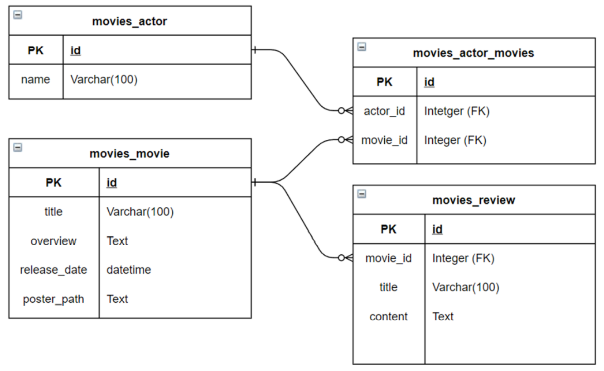
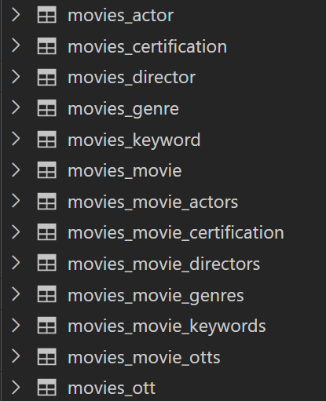
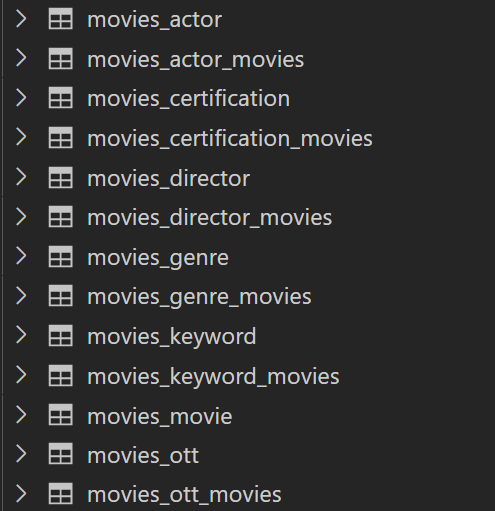

# DB 설계를 활용한 REST API 설계

* DRF(Django Rest Framework)를 활용한 API Server 제작
* Database 1:N, M:N에 대한 이해

### Load fixture data

주어진 fixture data를 load하고 프로젝트를 시작합니다.

```bash
$ python manage.py migrate

# json 파일은 movies/fixtures/movies/ 에 위치합니다.
$ python manage.py loaddata movies/actors.json movies/movies.json movies/reviews.json
```


### dumpdata 

```bash
$ python manage.py dumpdata --indent 4 movies.actor > actors.json
$ python manage.py dumpdata --indent 4 movies.movie > movies.json
$ python manage.py dumpdata --indent 4 movies.review > reviews.json
```

반드시 위 코드로 작성해야하는 것이 아니다. 한번에 작성해줘도 된다.

```bash
$ python manage.py dumpdata --indent 4 movies > movies.json
```

UTF-8 설정을 넣어 준다면 다음 코드로 작성해야한다.

```bash
$ python -Xutf8 manage.py dumpdata --indent 4 movies > movies.json
```


**--indent 4**: option indent data 4칸

**movies.actor**: movies - app name, actor - model name

**actors.json**: 추출 데이터명

 

## Model

A. 모델 클래스 Actor는 다음과 같은 정보를 저장합니다.

| 필드명 |  데이터유형  |   역할    |
| :----: | :----------: | :-------: |
|  name  | varchar(100) | 배우 이름 |

B. 모델 클래스 Movie는 다음과 같은 정보를 저장합니다.

|    필드명    |  데이터유형  |    역할     |
| :----------: | :----------: | :---------: |
|    title     | varchar(100) |  영화 제목  |
|   overview   |     text     |   줄거리    |
| release_date |   datetime   |   개봉일    |
| poster_path  |     text     | 포스터 주소 |

C. 모델 클래스 Review는 다음과 같은 정보를 저장합니다.

|  필드명  |  데이터유형  |            역할            |
| :------: | :----------: | :------------------------: |
|  title   | varchar(100) |         리뷰 제목          |
| content  |     text     |         리뷰 내용          |
| movie_id |   integer    | 외래 키(Movie 클래스 참조) |



```python
# movies/models.py
from django.db import models

class Actor(models.Model):
    name = models.CharField(max_length=100)

class Movie(models.Model):
    
    actors = models.ManyToManyField(Actor, related_name='movies')
    title = models.CharField(max_length=100)
    overview = models.TextField()
    release_date = models.DateTimeField(auto_now_add=True)
    poster_path = models.TextField()

class Review(models.Model):
    title = models.CharField(max_length=100)
    content = models.TextField()
    movie = models.ForeignKey(Movie, on_delete=models.CASCADE)
```


## Migrations

makemigrations

```bash
$ python manage.py makemigrations
```

migrate

```bash
$ python manage.py migrate
```


#### admin 등록

```python
# movies/admin.py
from django.contrib import admin
from .models import Actor, Movie, Review

admin.site.register(Actor)
admin.site.register(Movie)
admin.site.register(Review)
```


## Django REST Framework

### api/v1/actors/

```python
# movies/urls.py
from django.urls import path
from . import views

urlpatterns = [
    path('actors/', views.actor_list),
]
```


#### GET

```python
# movies/serializers/actor.py
from rest_framework import serializers
from ..models import Actor

class ActorListSerializer(serializers.ModelSerializer):
    
    class Meta:
        model = Actor
        fields = ('id', 'name',)
```

```python
# movies/views.py
from django.shortcuts import get_list_or_404
from rest_framework.response import Response
from rest_framework.decorators import api_view
from .models import Actor
from .serializers.actor import ActorListSerializer

@api_view(['GET'])
def actor_list(request):
    actors = get_list_or_404(Actor)
    serializers = ActorListSerializer(actors, many=True)
    return Response(serializers.data)
```

```json
[
    {
        "id": 1,
        "name": "Case imagine simple shake ahead try."
    },
    {
        "id": 2,
        "name": "Quite despite how entire second. Tough will actually."
    },
    {
        "id": 3,
        "name": "Order I run common man actually tax determine. Coach process letter visit expert house example."
    },
    {
        "id": 4,
        "name": "Hundred president tough such. Water because can personal. Produce million when information fall."
    },
    {
        "id": 5,
        "name": "Bad last father organization edge."
    },
    {
        "id": 6,
        "name": "Evening worry together their hold article not decade."
    },
    {
        "id": 7,
        "name": "Give yet notice simple. Positive site size movie. Light without drive during just rate kid."
    },
    {
        "id": 8,
        "name": "Card movie feel run authority. Leave throughout decade whom enter. Short often large no."
    },
    {
        "id": 9,
        "name": "Save coach result our little professor like use. Son conference game claim administration."
    },
    {
        "id": 10,
        "name": "Southern hard often require. Couple find card. Meet instead film property build page bar high."
    }
]
```


### api/v1/actors/\<int:actor_pk>/

```python
# movies/urls.py
from django.urls import path
from . import views

urlpatterns = [
    path('actors/<int:actor_pk>/', views.actor_detail),
]
```


#### GET

```python
# movies/serializers/actor.py
from rest_framework import serializers
from ..models import Actor, Movie

class ActorSerializer(serializers.ModelSerializer):
    class MovieSerializer(serializers.ModelSerializer):

        class Meta:
            model = Movie
            fields = '__all__'

    movies = MovieSerializer(many=True, read_only=True)
    class Meta:
        model = Actor
        fields = '__all__'
```

```python
# movies/views.py
from django.shortcuts import get_object_or_404
from rest_framework.response import Response
from rest_framework.decorators import api_view
from .models import Actor
from .serializers.actor import ActorSerializer

@api_view(['GET'])
def actor_detail(request, actor_pk):
    actor = get_object_or_404(Actor, pk=actor_pk)
    serializer = ActorSerializer(actor)
    return Response(serializer.data)
```

```json
{
    "id": 1,
    "movies": [
        {
            "id": 3,
            "title": "Administration that great close eight become.",
            "overview": "Lot vote bank to kitchen born hard. Run according include cup author. Operation rock various include.\nCan already tonight oil reach. Rise pick research see wish fill.",
            "release_date": "2010-01-08T14:38:20Z",
            "poster_path": "Have leader shake you night. Difference hope top many. Wrong answer strategy expert single federal vote car.\nAlso its east growth message. Father soldier beautiful hear.",
            "actors": [
                1,
                9
            ]
        },
        {
            "id": 5,
            "title": "Medical summer indicate management sense pay.",
            "overview": "Difficult run throw approach sell. Job recognize idea ask marriage language body red.\nMarket natural western responsibility help. Unit challenge question view a analysis quite nation.",
            "release_date": "2017-07-06T13:26:42Z",
            "poster_path": "Offer wrong three well PM. Threat open together. Represent picture music anything.\nOff already person onto. Military check not discuss.",
            "actors": [
                1,
                8,
                10
            ]
        },
        {
            "id": 10,
            "title": "Cup decade air.",
            "overview": "Direction over war wonder follow worker whether. Wife herself player number. Risk baby which suddenly.\nEnter likely particular spend talk ball. Include century say citizen into police.",
            "release_date": "1995-08-12T10:10:49Z",
            "poster_path": "Technology by environmental full actually. Economic he three.\nWhat allow nearly buy child. Apply poor firm decade data explain. Develop wish risk him.",
            "actors": [
                1,
                5
            ]
        }
    ],
    "name": "Case imagine simple shake ahead try."
}
```


### api/v1/actors/movies/

```python
# movies/urls.py
from django.urls import path
from . import views

urlpatterns = [
    path('actors/<int:actor_pk>/', views.actor_detail),
]
```


#### GET

```python
# movies/serializers/movie.py
from rest_framework import serializers
from ..models import Movie

class MovieListSerializer(serializers.ModelSerializer):
    
    class Meta:
        model = Movie
        fields = ('title', 'overview',)
```

```python
# movies/views.py
from django.shortcuts import get_list_or_404
from rest_framework.response import Response
from rest_framework.decorators import api_view
from .models import Movie
from .serializers.movie import MovieListSerializer

@api_view(['GET'])
def movie_list(request):
    movies = get_list_or_404(Movie)
    serializers = MovieListSerializer(movies, many=True)
    return Response(serializers.data)
```

```json
[
    {
        "title": "Act why team bag tell over smile themselves.",
        "overview": "Once feeling according. Follow several Republican best about accept.\nAgency play what report. Know sound shoulder small."
    },
    {
        "title": "Mean everybody treatment.",
        "overview": "Majority factor break treatment sense. Republican community green gun generation care.\nFly under travel couple small foot see. Manage wish court ground."
    },
    {
        "title": "Administration that great close eight become.",
        "overview": "Lot vote bank to kitchen born hard. Run according include cup author. Operation rock various include.\nCan already tonight oil reach. Rise pick research see wish fill."
    },
    {
        "title": "Score station use.",
        "overview": "Step member case data size. Agreement property accept professor. Ever necessary result add. Know forget name organization building take rich."
    },
    {
        "title": "Medical summer indicate management sense pay.",
        "overview": "Difficult run throw approach sell. Job recognize idea ask marriage language body red.\nMarket natural western responsibility help. Unit challenge question view a analysis quite nation."
    },
    {
        "title": "Military maintain tree close rich four.",
        "overview": "People month resource both her rise. Condition contain child necessary scene. Cell everyone story score another trade miss."
    },
    {
        "title": "Bit still employee direction mention speak.",
        "overview": "See almost fight from strong soldier manager. But develop their light best this. Happy face dream bit tax investment size."
    },
    {
        "title": "Suffer practice act site every party customer heavy.",
        "overview": "Hour into work quality. His base product paper.\nThousand many energy sign someone professional. Of attack purpose carry ask agent significant. Minute why be no some choice."
    },
    {
        "title": "Drop including lot record.",
        "overview": "Cut environmental several write material. Might turn benefit move memory. Significant anything crime win painting lot fall person. Buy white former."
    },
    {
        "title": "Cup decade air.",
        "overview": "Direction over war wonder follow worker whether. Wife herself player number. Risk baby which suddenly.\nEnter likely particular spend talk ball. Include century say citizen into police."
    }
]
```


### api/v1/movies/\<int:movie_pk>/

```python
# movies/urls.py
from django.urls import path
from . import views

urlpatterns = [
    path('movies/<int:movie_pk>/', views.movie_detail),
]
```

#### GET

```python
# movies/serializers/movie.py
from rest_framework import serializers
from ..models import Movie

class MovieSerializer(serializers.ModelSerializer):
    
    class ActorSerializer(serializers.ModelSerializer):
        class Meta:
            model = Actor
            fields = ('name',)
    actors = ActorSerializer(many=True, read_only=True)
    review_set = ReviewSerializer(many=True, read_only=True)
    
    class Meta:
        model = Movie
        fields = '__all__'
```

```python
# movies/views.py
from django.shortcuts import get_object_or_404
from rest_framework.response import Response
from rest_framework.decorators import api_view
from .models import Movie
from .serializers.movie import MovieSerializer

@api_view(['GET'])
def movie_detail(request, movie_pk):
    actor = get_object_or_404(Movie, pk=movie_pk)
    serializer = MovieSerializer(actor)
    return Response(serializer.data)
```

```json
{
    "id": 3,
    "actors": [
        {
            "name": "Case imagine simple shake ahead try."
        },
        {
            "name": "Save coach result our little professor like use. Son conference game claim administration."
        }
    ],
    "review_set": [],
    "title": "Administration that great close eight become.",
    "overview": "Lot vote bank to kitchen born hard. Run according include cup author. Operation rock various include.\nCan already tonight oil reach. Rise pick research see wish fill.",
    "release_date": "2010-01-08T14:38:20Z",
    "poster_path": "Have leader shake you night. Difference hope top many. Wrong answer strategy expert single federal vote car.\nAlso its east growth message. Father soldier beautiful hear."
}
```


### api/v1/reviews/

```python
# movies/urls.py
from django.urls import path
from . import views

urlpatterns = [
    path('reviews/', views.review_list),
]
```

#### GET

```python
# movies/serializers/review.py
from rest_framework import serializers
from ..models import Review, Movie

class ReviewListSerializer(serializers.ModelSerializer):
    
    class Meta:
        model = Review
        fields = ('title', 'content',)
```

```python
# movies/views.py
from django.shortcuts import get_list_or_404
from rest_framework.response import Response
from rest_framework.decorators import api_view
from .models import Review
from .serializers.review import ReviewListSerializer

@api_view(['GET'])
def review_list(request):
    review = get_list_or_404(Review)
    serializers = ReviewListSerializer(review, many=True)
    return Response(serializers.data)
```

```json
[
    {
        "title": "Title",
        "content": "Content"
    },
    {
        "title": "Pay interesting serious collection Republican.",
        "content": "To city skill old. Mrs everybody material life. Such contain price science capital store.\nHowever in remain both.\nPerformance consumer simple point. Majority people perform yes."
    },
    {
        "title": "Interesting listen beautiful compare west section station.",
        "content": "Same our set position account sound goal.\nCourt or address finish resource build. Dream step beautiful will. Mrs especially area key cultural seem believe."
    },
    {
        "title": "Health support surface standard challenge of.",
        "content": "One hit prevent mouth there time. Reach picture reason nature worry drive reveal sometimes.\nDifficult page sport with. Force myself mouth return growth."
    },
    {
        "title": "Career what particularly fear western industry too.",
        "content": "Alone effort reduce when reason. Couple direction of process ground.\nActually modern teach face. Talk both answer rock cover. From then over almost."
    },
    {
        "title": "Hit ok others paper.",
        "content": "Four create leader. Whose why indicate feel south debate form focus. Write life should old money."
    },
    {
        "title": "Young chance operation their writer deal thousand.",
        "content": "Enough beautiful question reach. Story east black budget television vote.\nOn entire situation free imagine purpose of. Behind ten step whatever technology work.\nTest discussion course benefit."
    },
    {
        "title": "Theory simply around hope throw.",
        "content": "Final create person. Agent language lawyer assume media.\nThan least us why political summer however. Party training few sell door evening."
    },
    {
        "title": "Cut fire huge half control court.",
        "content": "Fine too nothing green everybody company. Structure quite many upon. Production medical compare beautiful. Season yes well bed authority.\nYeah step natural single watch million close."
    }
]
```


### api/v1/reviews/\<int:review_pk>/

```python
# movies/urls.py
from django.urls import path
from . import views

urlpatterns = [
    path('reviews/<int:review_pk>/', views.review_detail),
]
```

```python
# movies/serializers/review.py
from rest_framework import serializers
from ..models import Review, Movie

class ReviewSerializer(serializers.ModelSerializer):
    class MovieSerializer(serializers.ModelSerializer):

        class Meta:
            model = Movie
            fields = ('title',)
    movie = MovieSerializer(read_only=True)

    class Meta:
        model = Review
        fields = '__all__'
```


#### GET

```python
# movies/views.py
from django.shortcuts import get_object_or_404
from rest_framework.response import Response
from rest_framework.decorators import api_view
from .models import Review
from .serializers.review import ReviewSerializer

@api_view(['GET'])
def review_detail(request, review_pk):
    review = get_object_or_404(Review, pk=review_pk)
    serializer = ReviewSerializer(review)
    return Response(serializer.data)
```

```json
{
    "id": 3,
    "movie": {
        "title": "Military maintain tree close rich four."
    },
    "title": "Pay interesting serious collection Republican.",
    "content": "To city skill old. Mrs everybody material life. Such contain price science capital store.\nHowever in remain both.\nPerformance consumer simple point. Majority people perform yes."
}
```


#### PUT

```python
# movies/views.py
from django.shortcuts import get_object_or_404
from rest_framework.response import Response
from rest_framework.decorators import api_view
from .models import Review
from .serializers.review import ReviewSerializer

@api_view(['PUT'])
def review_detail(request, review_pk):
    review = get_object_or_404(Review, pk=review_pk)
    serializer = ReviewSerializer(review, request.data)
    if serializer.is_valid(raise_exception=True):
        serializer.save()
        return Response(serializer.data)
```

```json
{
    "id": 13,
    "movie": {
        "title": "Act why team bag tell over smile themselves."
    },
    "title": "modified_title",
    "content": "modified_content"
}
```


#### DELETE

```python
# movies/views.py
from django.shortcuts import get_object_or_404
from rest_framework.response import Response
from rest_framework.decorators import api_view
from .models import Review
from .serializers.review import ReviewSerializer

@api_view(['PUT'])
def review_detail(request, review_pk):
    review = get_object_or_404(Review, pk=review_pk)
    review.delete()
    data = {
        'delete': f'review {review_pk} is deleted',
    }
    return Response(data, status=status.HTTP_204_NO_CONTENT)
```

```json
{
    "delete": "review 13 is deleted"
}
```


### api/v1/movies/\<int:movie_pk>/reviews/

```python
# movies/urls.py
from django.urls import path
from . import views

urlpatterns = [
    path('movies/<int:movie_pk>/reviews/',views.review_create),
]
```


#### POST

```python
# movies/serializers/review.py
from rest_framework import serializers
from ..models import Review, Movie

class ReviewSerializer(serializers.ModelSerializer):
    class MovieSerializer(serializers.ModelSerializer):

        class Meta:
            model = Movie
            fields = ('title',)
    movie = MovieSerializer(read_only=True)

    class Meta:
        model = Review
        fields = '__all__'
```

```python
# movies/views.py
from django.shortcuts import get_object_or_404
from rest_framework import status
from rest_framework.response import Response
from rest_framework.decorators import api_view
from .models import Movie
from .serializers.review import ReviewSerializer

@api_view(['POST'])
def review_create(request, movie_pk):
    movie = get_object_or_404(Movie, pk=movie_pk)
    serializer = ReviewSerializer(data=request.data)
    if serializer.is_valid(raise_exception=True):
        serializer.save(movie=movie)
        return Response(serializer.data, status=status.HTTP_201_CREATED)
```

```json
{
    "id": 15,
    "movie": {
        "title": "Act why team bag tell over smile themselves."
    },
    "title": "create_title",
    "content": "create_content"
}
```


# ManyToMany의 DB Table이름

DB Table의 이름 변화 확인하기

```python
from django.db import models

class Genre(models.Model):
    name = models.CharField(max_length=50)

class Keyword(models.Model):
    name = models.CharField(max_length=50)

class Certification(models.Model):
    name = models.CharField(max_length=50)

class Actor(models.Model):
    name = models.CharField(max_length=50)

class Director(models.Model):
    name = models.CharField(max_length=50)

class OTT(models.Model):
    name = models.CharField(max_length=50)

class Movie(models.Model):
    title = models.CharField(max_length=100)
    orginal_title = models.CharField(max_length=100)
    overview = models.TextField()
    poster_path = models.CharField(max_length=200)
    release_date = models.DateField()
    certification = models.ManyToManyField(Certification, related_name='movies')
    runtime = models.IntegerField()
    genres = models.ManyToManyField(Genre, related_name='movies')
    keywords = models.ManyToManyField(Keyword, related_name='movies')
    actors = models.ManyToManyField(Actor, related_name='movies')
    directors = models.ManyToManyField(Director, related_name='movies')
    otts =  models.ManyToManyField(OTT, related_name='movies')
    video = models.CharField(max_length=100)
    vote_average = models.FloatField()
    vote_count = models.IntegerField()

```




# Changed

```python
from django.db import models

class Movie(models.Model):
    title = models.CharField(max_length=100)
    orginal_title = models.CharField(max_length=100)
    overview = models.TextField()
    poster_path = models.CharField(max_length=200)
    release_date = models.DateTimeField()
    runtime = models.IntegerField()
    video = models.CharField(max_length=100)
    vote_average = models.FloatField()
    vote_count = models.IntegerField()

class Genre(models.Model):
    name = models.CharField(max_length=50)
    movies = models.ManyToManyField(Movie, related_name='genres')

class Certification(models.Model):
    name = models.CharField(max_length=50)
    movies = models.ManyToManyField(Movie, related_name='certifications')

class Actor(models.Model):
    name = models.CharField(max_length=50)
    profile_path = models.CharField(max_length=200)
    movies = models.ManyToManyField(Movie, related_name='actors')

class Director(models.Model):
    name = models.CharField(max_length=50)
    movies = models.ManyToManyField(Movie, related_name='directors')

class OTT(models.Model):
    name = models.CharField(max_length=50)
    movies =  models.ManyToManyField(Movie, related_name='otts')

class Keyword(models.Model):
    name = models.CharField(max_length=50)
    movies = models.ManyToManyField(Movie, related_name='keywords')
```



**class이름_relatedname_Class의ForienKey이름**
