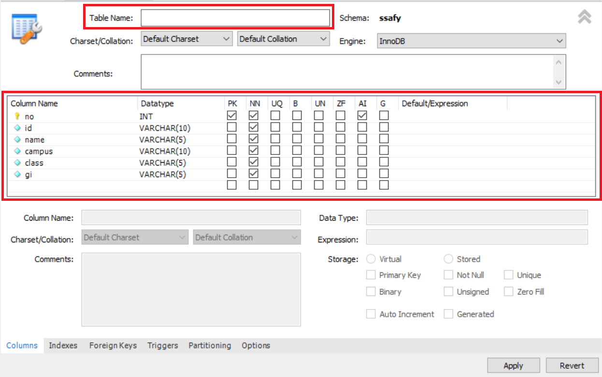
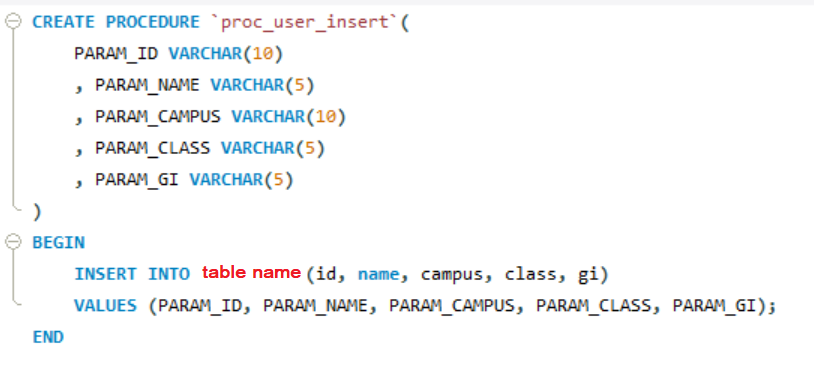
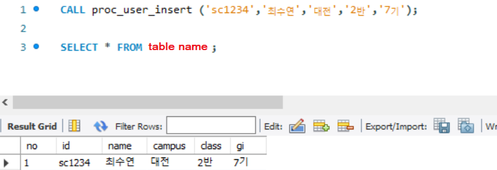

## MySQL Procedure

### 테이블 신규 생성

테이블 명, 컬럼 작성



작성 후 이에 따른 SQL문을 확인할 수 있다.

```sql
CREATE TABLE `위치`.`테이블명` (
  `no` INT NOT NULL AUTO_INCREMENT,
  `id` VARCHAR(10) NOT NULL,
  `name` VARCHAR(5) NOT NULL,
  `campus` VARCHAR(10) NOT NULL,
  `class` VARCHAR(5) NOT NULL,
  `gi` VARCHAR(5) NOT NULL,
  PRIMARY KEY (`no`));
```


### 요구사항의 기능을 만족하는 저장 프로시저 작성

요구사항

1. 저장 프로시저는 신규테이블의 컬럼에 입력될 값을 입력 변수로 받아야 한다.

2. 생성된 프로시저에 교육생 본인의 정보를 입력 변수로 넣고 실행한다.

​	입력변수 : 본인임의아이디, 본인이름, 본인소속캠퍼스, 본인소속반, 본인기수

3. 위에 작성한 프로시저 내용과 프로시저를 실행하여 입력된 데이터의 select 결과를 아래와 같이 출력하여 제출한다.

:heavy_check_mark: Stored Procedures 우클릭 **Create Stored Procedure**

```sql
/*사용자등록 프로시저*/
CREATE PROCEDURE `proc_user_insert`(
	PARAM_ID VARCHAR(10)
    , PARAM_NAME VARCHAR(5)
    , PARAM_CAMPUS VARCHAR(10)
    , PARAM_CLASS VARCHAR(5)
    , PARAM_GI VARCHAR(5)
)
BEGIN
    INSERT INTO 테이블명(id, name, campus, class, gi) 
    VALUES (PARAM_ID, PARAM_NAME, PARAM_CAMPUS, PARAM_CLASS, PARAM_GI);
END
```

**SQL Script**

```sql
USE `위치`;
DROP procedure IF EXISTS `proc_user_insert`;

DELIMITER $$
USE `위치`$$
CREATE PROCEDURE `proc_user_insert`(
	PARAM_ID VARCHAR(10)
    , PARAM_NAME VARCHAR(5)
    , PARAM_CAMPUS VARCHAR(10)
    , PARAM_CLASS VARCHAR(5)
    , PARAM_GI VARCHAR(5)
)
BEGIN
    INSERT INTO 테이블명(id, name, campus, class, gi) 
    VALUES (PARAM_ID, PARAM_NAME, PARAM_CAMPUS, PARAM_CLASS, PARAM_GI);
END$$

DELIMITER ;
;
```



```sql
CALL proc_user_insert ('sc1234','최수연','대전','2반','7기');

SELECT * FROM ssafy_user;
```

