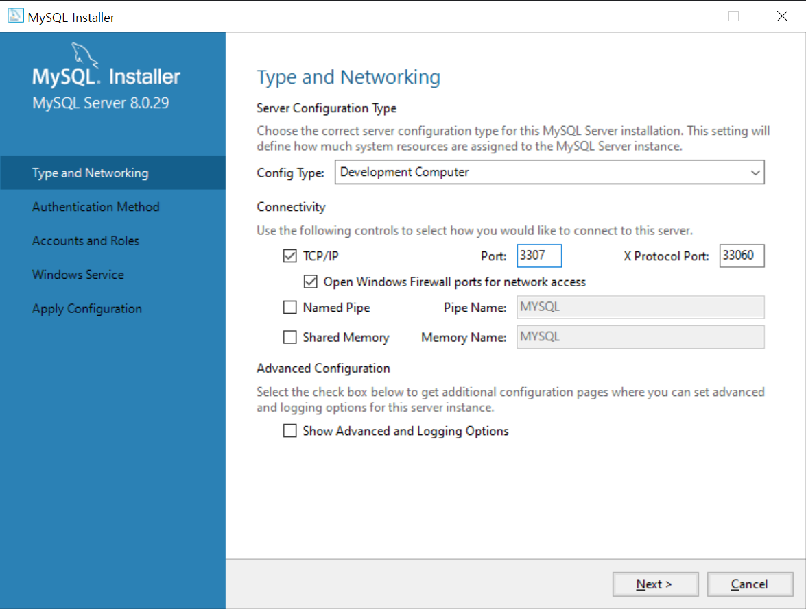
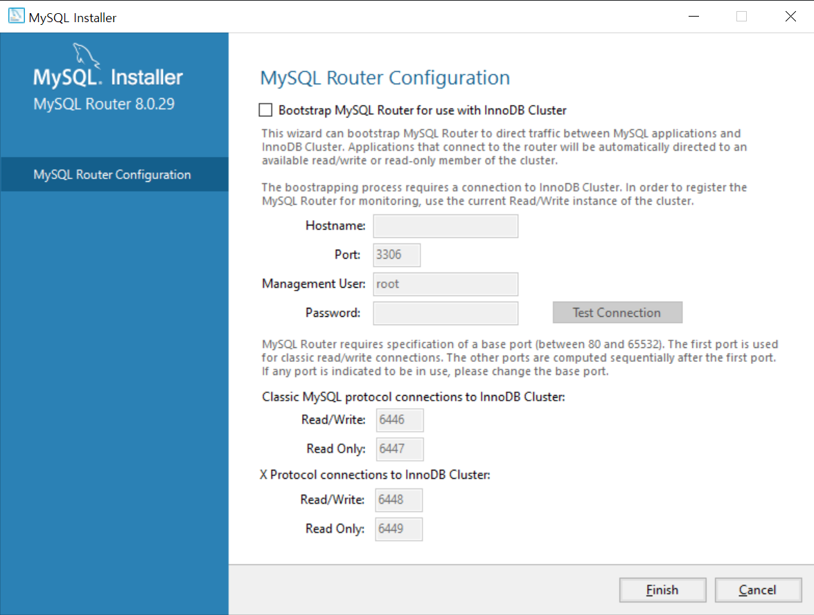
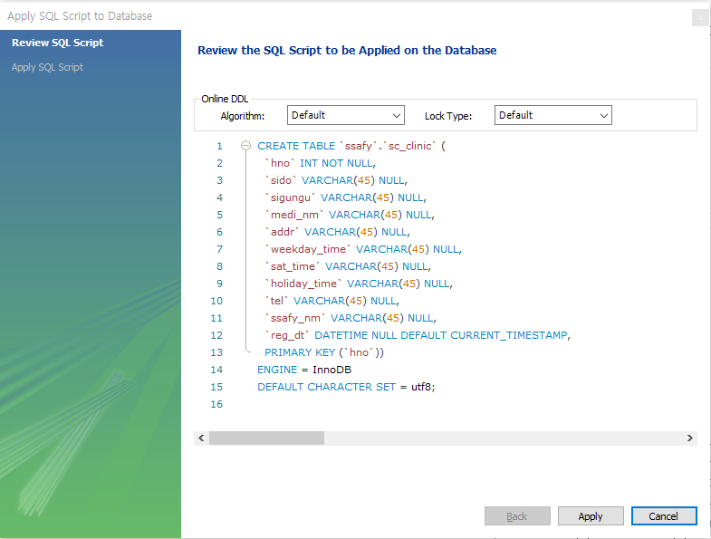
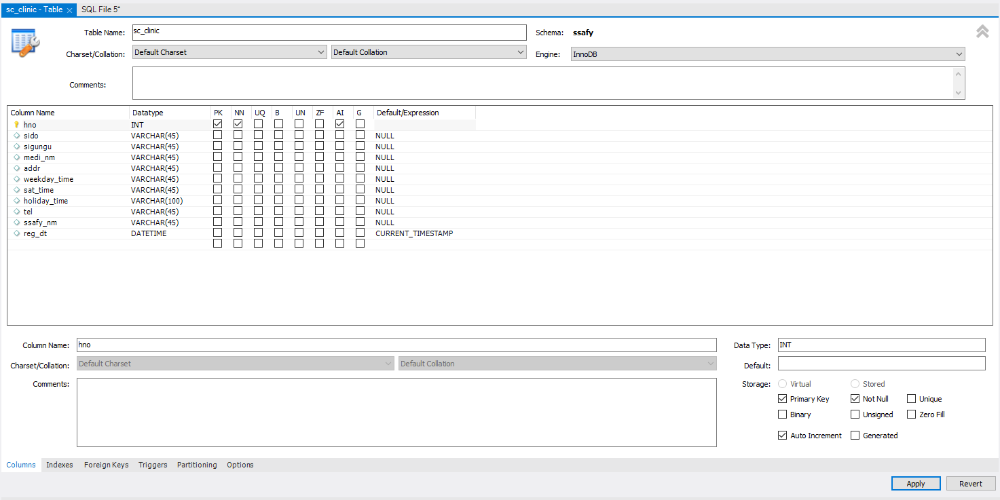
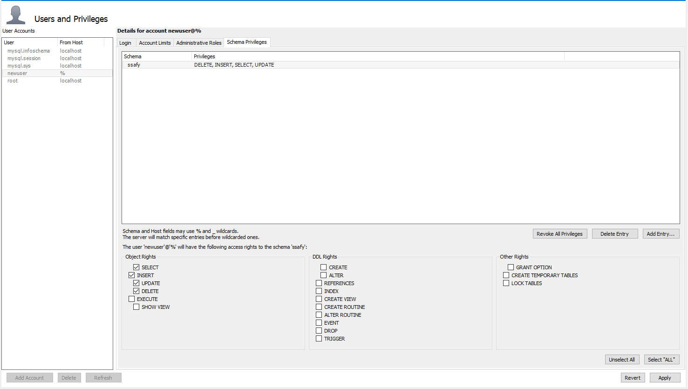
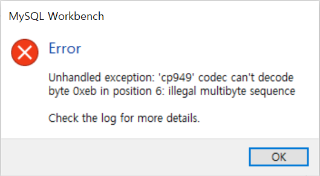

## MySQL_data_processing

### MySQL 설치



MySQL의 기본 Port는 3306이다

import하는 과제를 수행하려고 하니 기존에 사용해본 MySQL이 이미 있어 3306 포트를 사용할 수 없었다.

고민을 하다 몇가지 이유로 3307포트를 사용하기로 했다.

1. 기존에 MySQL에서 사용하던 데이터를 남겨두기 위함이다.
2. 검색을 통해 Port를 삭제 변경하는 경우가 있다는 것을 알았기 때문이다.
3. 나중에 생길 문제를 고민하면서 주저하지 말자고 생각했기 때문이다.

:heavy_check_mark: 위 사진을 첨부한 이유는 체크하지 않았기 때문에 영향이 없지만 Port가 3306으로 되어있어 만약 필요한 경우 확인해야하기 때문이다.




### 필요한 컬럼들만 정제

Import하는 data를 확인하여 두개 컬럼을 합치고 데이터 사이에 /를 추가해주는 방법을 활용하는 방법은 다음과 같다.

그 컬럼을 생성하기 위해 아래 코드를 사용했다.

```
=TEXTJOIN("/",TRUE,G2,H2)
```


### Mysql 윈도우 버전 로컬 DB에 적재한다.

주어진 정보에 따라 테이블을 생성했다.





:warning: 이 코드는 결국 수정하게 된다.

PK값을 잘 설정했다고 생각했는데 AUTO_INCREMENT 설정이 되어있지 않아 import 할때 오류가 발생했다.

```sql
ALTER TABLE sc_clinic MODIFY hno INT NOT NULL AUTO_INCREMENT;
```

과제 조건에 sql 쿼리를 이용하여 reg_dt 컬럼에 등록일시(년월일시분초) 일괄 입력을 하는 것이지만 DATETIME으로 Datatype을 설정하고 오류를 확인하고 싶어 CURRENT_TIMESTAMP까지 설정하였다.


### DB계정 생성



계정 생성을 하고 Object Rights는 SELECT, INSERT, UPDATE, DELETE만 주었다.

EXECUTE와 SHOW VIEW는 정확하게 이해하고 있는 부분이 아니라 선택하지 않았다.


### Import .csv data



Import 방법이 단순하여 바로 시도했는데 위와 같은 오류가 발생했다.

나의 해결 방법은 다음과 같다.

1. 컬럼명을 한글에서 영어로 바꿀 것. 나의 경우 컬럼명과 매치되는 컬럼ID로 설정했다.
2. Excel에서 저장할 때에 CSV UTF-8(쉼표로 분리)가 아닌 CSV (쉼표로 분리)를 선택했다.


### Sql 쿼리를 이용하여 특정 컬럼에 작성자명 일괄 입력

이 부분에서 

`You are using safe update mode and you tried to update a table without a WHERE that uses a KEY column To disable safe mode, toggle the option in Preferences -> SQL Editor and reconnect.`

라는 오류 코드가 발생했다. 이 문제를 해결하면서 전체적인 환경을 바꾸지 않기 위해

 `SET sql_safe_updates=0;` 코드를 활용했다. 이 코드와 UPDATE 쿼리문을 이용하여 작성자명을 일괄입력했다.

```sql
SET sql_safe_updates=0;
UPDATE sc_clinic SET 컬럼 ='일괄 내용';
```


### Sql 쿼리를 이용하여 reg_dt 컬럼에 등록일시(년월일시분초) 일괄 입력

```sql
UPDATE sc_clinic SET reg_dt = now();
```

테이블을 만들었을 때의 설정때문에 이미 값이 들어있는 reg_dt 컬럼이지만 위 코드를 활용하여 현재 시간을 일괄 입력하도록 했다.
