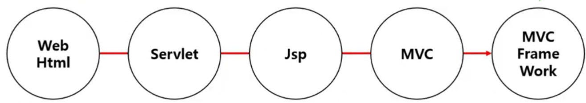
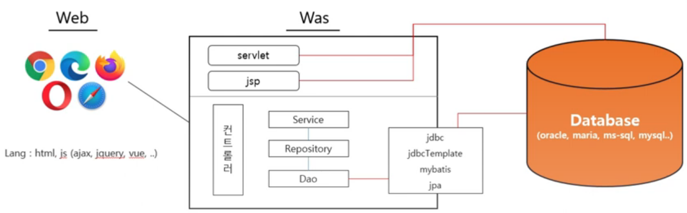
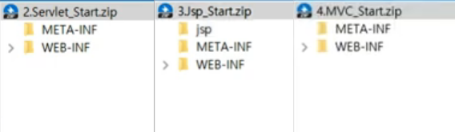
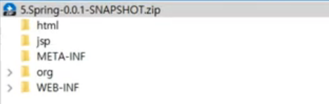

# Web Programming

## Web Programming 변화과정

### Web HTML

Web의 UI는 절대적으로 HTML로 구현한다.

**Web의 대중화로 Web을 통한 데이터 입/출력으 필요성이 생긴다. (Dynamic Web)**

### Servlet

Java진영에서 Web Program을 지원하기 위해 나온 개발 프로그램

Web의 UI는 계속 HTML로 구현한다.

Web의 대중화로 Web을 통한 데이터 입/출력의 필요성이 생겼다.

=> 웹페이지의 동적 생성 = Dynamic Web

**Servlet에 HTML을 구현한다.**

예시)

Servlet의 Member_List를 가져온다.

Member_List.java 파일에 HTML을 하나하나 넣어 화면에 보여주게 되는 것이다.

### Jsp (↔Servlet)

Java진영에서 HTML에 Java언어를 넣는 방법을 고안했다.

초기에는 Servlet에서 벗어난 개발자들이 선호했으나

**시간이 지날수록 Jsp내의 자바 코드가 스파게티가 되어 개발자들이 후회했다.**

### MVC

HTML와 JAVA를 분리하자는 움직임에 따라 Frontend, Backend를 분리하게 되었다.

Java 내부에서도 받아들이는 입구와 비즈니스 부분을 분리하는 움직임이 생겼다. (MVC)

**표준 없이 개발자마다 MVC를 구현하는 상황이 발생했다.**

HTML ➡ Servlet ➡ Jsp ➡ MVC

### MVC Framework

Java진영에서 MVC 개발 프레임워크를 만들어 배포

Spring이 개발자들에게 봄을 선사하기 위해 나타났다.

Spring이 더욱 간편해진 Springboot이 만들어졌다.

* 세분화
* Publisher, Java 개발, Script 계열언어, DB 관리자

WAR로 묶어 배포할 때는 아래와 같은 구조를 가지고 있어야한다.

Spring에서 build.gradle로 WAR파일 생성 후 구조확인

