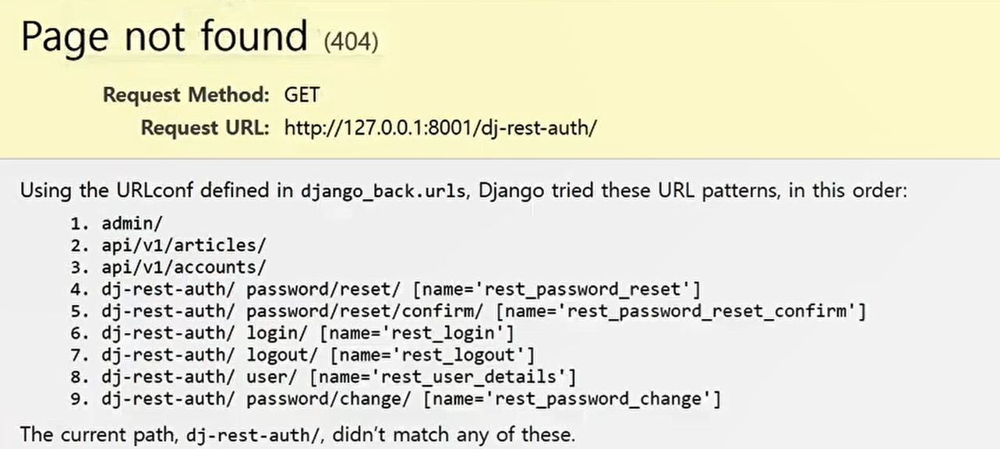
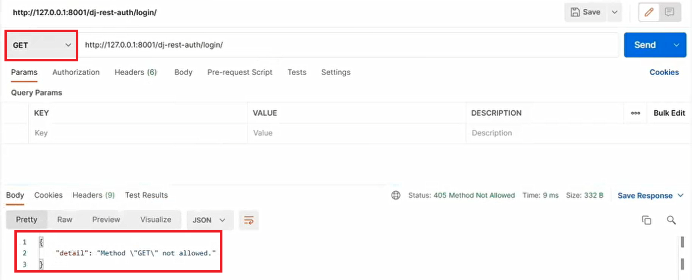
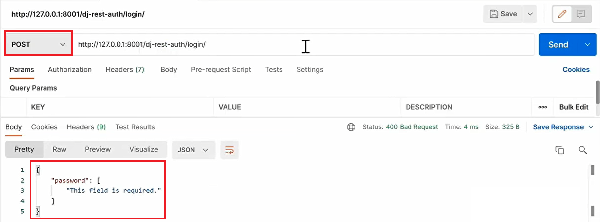
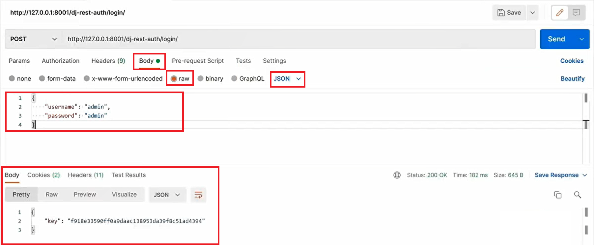
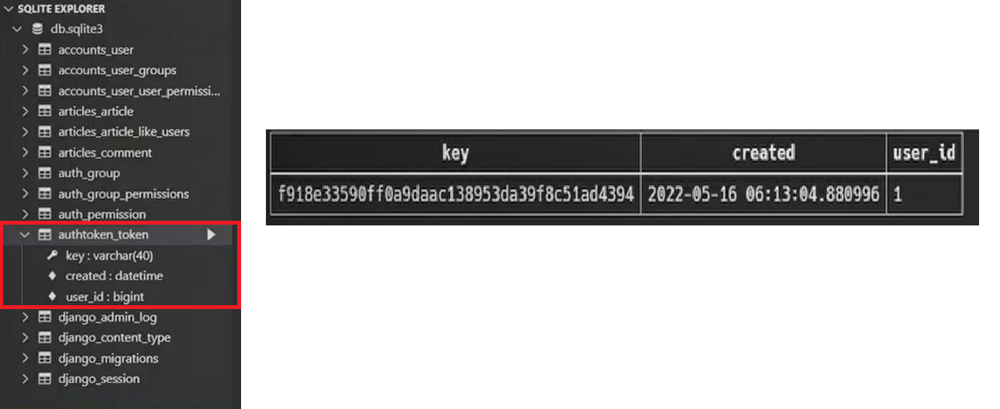
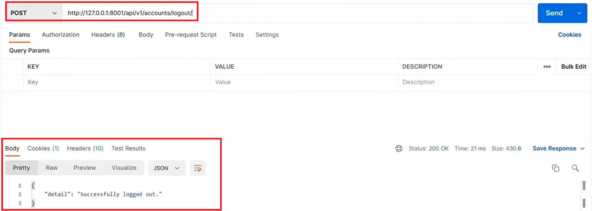
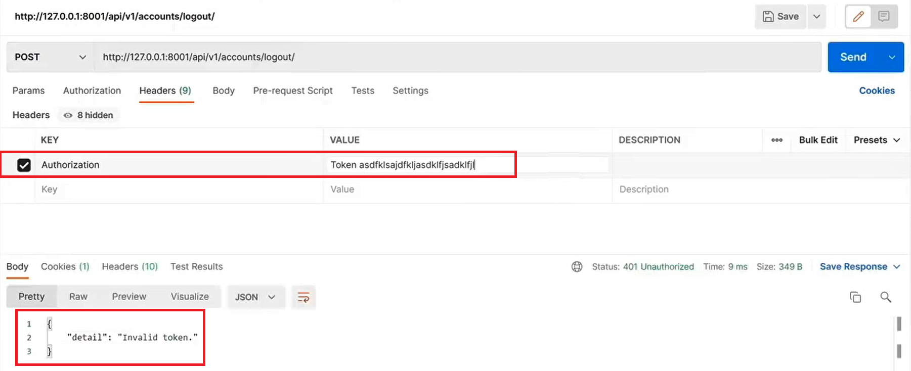
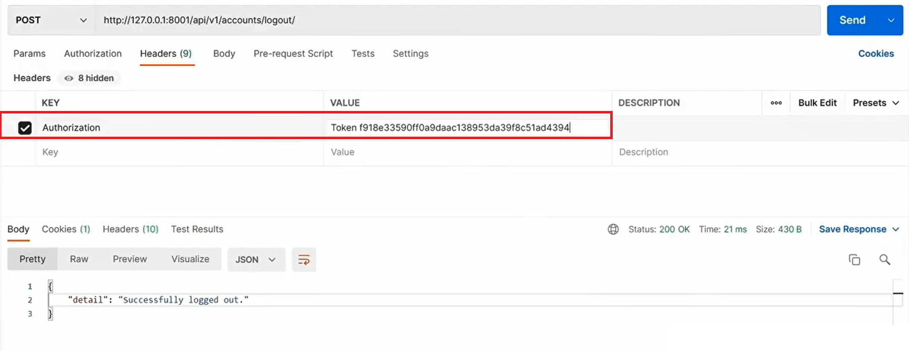
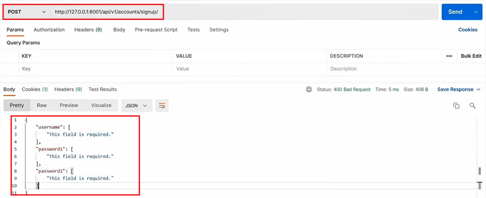
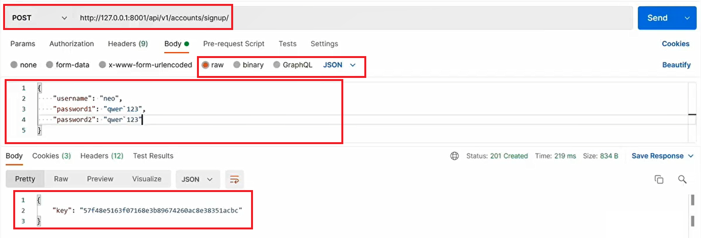

# Vue 04

## Server & Client

### Server

클라이언트에게 '정보', '서비스'를 제공하는 컴포터 시스템

정보 & 서비스

* Django를 통해 응답한 template
* DRF를 통해 응답한 JSON


### Client

서버에게 그 서버가 맡는(서버가 제공하는) 서비스를 요청하고, 서비스 요청을 위해 필요한 인자를 서버가 요구하는 방식에 맞게 제공하며, 서버로부터 반환되는 응답을 사용자에게 적절한 방식으로 표현하는 기능을 가진 시스템

서버에게 그 서버가 맡는(서버가 제공하는) **서비스를 요청**하고, 서비스 요청을 위해 필요한 인자를 **서버가 요구하는 방식에 맞게 제공**하며, 서버로부터 반환되는 응답을 **사용자에게 적절한 방식으로 표현**하는 기능을 가진 시스템

서버에 올바른 요청 제공: urls.py에 작성한 것대로 URL을 알아들을 수 있게 보낸다.

원하는 data(JSON)을 받고 Vue를 통해 사용자가 볼 수 있는 HTML로 바뀐다.


### 정리

Server는 **"정보제공"**

* DB와 통신하며 데이터를 CRUD
* 요청을 보낸 Client에게 이러한 정보를 응답한다.

Client는 **"정보 요청 & 표현"**

* Server에게 정보(데이터) 요청한다.
* 응답 받은 정보를 잘 가공하여 화면에 보여준다.


## Start Project Model + Serializer

```bash
$ python -m venv
```

.gitignore

pip install - django,  rest_framework (+ django extension ) - requirements.txt

```bash
$ django-admin startproject 이름 .
$ python manage.py startapp 이름
```

**settings.py**

```python
INSTALLED_APPS =[
	# local apps
    accounts
    articles
    
    # 3rd party apps
    django_extensions
    rest_framework
    
    # native apps
    
]

AUTH_USER_MODEL = 'accounts.User'
```

**accounts/models.py**

```python
from django.db import models
from django.contrib.auth.models import AbstractUser


class User(AbstractUser):
    pass
```

**articles/models.py**

```python
from django.db import models
from django.conf import settings

class Article(models.Model):
    user = models.ForeignKey(settings.AUTH_USER_MODEL, on_delete=models.CASCADE, related_name='articles')
    title = models.CharField(max_length=100)
    content = models.TextField()
    created_at = models.DateTimeField(auto_now_add=True)
    updated_at = models.DateTimeField(auto_now=True)
    like_users = models.ManyToManyField(settings.AUTH_USER_MODEL, related_name='like_articles')


class Comment(models.Model):
    user = models.ForeignKey(settings.AUTH_USER_MODEL, on_delete=models.CASCADE, related_name='comments')
    article = models.ForeignKey(Article, on_delete=models.CASCADE, related_name='comments')
    content = models.CharField(max_length=200)
    created_at = models.DateTimeField(auto_now_add=True)
    updated_at = models.DateTimeField(auto_now=True)
```

**urls.py**

```python
from django.contrib import admin
from django.urls import path, include

urlpatterns = [
    path('admin/', admin.site.urls),
    path('api/v1/articles/', include('articles.urls')),
    path('api/v1/accounts/', include('accounts.urls')),
]
```

:heavy_check_mark: makemigrations, migrate

```bash
$ python manage.py createsuperuser
```


### Serializer

: model이 있을 때 그 data들을 가지고 JSON과 연동하는 것(parse, stringify) 

CUD에서 Validation이 핵심(fields 검증)

R에서 Data Serializing

:heavy_check_mark: 이미 세운 기획에 맞춰 serializer 작성해야한다.

```python
from rest_framework import serializers
from django.contrib.auth import get_user_model

from ..models import Article
from .comment import CommentSerializer

User = get_user_model()


class ArticleSerializer(serializers.ModelSerializer):
    
    class UserSerializer(serializers.ModelSerializer):
        class Meta:
            model = User
            fields = ('pk', 'username')

    comments = CommentSerializer(many=True, read_only=True)
    user = UserSerializer(read_only=True)
    like_users = UserSerializer(read_only=True, many=True)

    class Meta:
        model = Article
        fields = ('pk', 'user', 'title', 'content', 'comments', 'like_users')


# Article List Read
class ArticleListSerializer(serializers.ModelSerializer):
    class UserSerializer(serializers.ModelSerializer):
        class Meta:
            model = User
            fields = ('pk', 'username')

    user = UserSerializer(read_only=True)
    # queryset annotate (views에서 채워줄것!)
    comment_count = serializers.IntegerField()
    like_count = serializers.IntegerField()

    class Meta:
        model = Article
        fields = ('pk', 'user', 'title', 'comment_count', 'like_count')
```


## CORS

### Same-origin policy (SOP)

"동일 출처 정책"

특정 출처(origin)에서 불러오 문서나 스크립트가 다른 출처에서 가져온 리소스와 상호작용하는 것을 제한하는 보안 방식이다.

잠재적으로 해로울 수 있는 문서를 분리함으로써 공경받을 수 있는 경로를 줄인다.


### Origin(출처)

두 URL의 Protocol, Port, Host가 모두 같아야 동일한 출처라 할 수 있다.

URL `http://store.company.com/dir/page.html`의 출처를 비교

| URL                                               | 결과 | 이유                                         |
| ------------------------------------------------- | ---- | -------------------------------------------- |
| `http://store.company.com/dir2/other.html`        | 성공 | 경로가 다르다.                               |
| `http://store.company.com/dir/inner/another.html` | 성공 | 경로가 다르다.                               |
| `https://store.company.com/secure.html`           | 실패 | 프로토콜이 다르다.                           |
| `http://store.company.com:81/dir/etc.html`        | 실패 | 포트가 다르다.<br />(http://는 80이 기본 값) |
| `http://news.company.com/dir/other.html`          | 실패 | 호스트가 다르다.                             |


### Cross-Origin Resource Sharing (CORS)

"교차 출처 리소스(자원)공유"

**추가 HTTP header를 사용**하여, 특정 출처에서 실행중인 웹 애플리케이션이 **다른 출처의 자원에 접근 할 수 있는 권한을 부여하도록 브라우저에 알려주는 체제**이다.

리소스가 자신의 출처(Domain, Protocol, Port)와 다를 때 교차 출처 HTTP 요청을 실행한다.

보안 상의 이유로 브라우저는 교차 출처 HTTP 요청을 제한한다.(SOP)

* 예를 들어 XMLHttpRequest는 SOP를 따른다.

다른 출처의 리소스를 불러오려면 그 출처에서 **올바른 CORS header를 포함한 응답을 반환**해야 한다.


### Cross-Origin Resource Sharing Policy (CORS Policy)

교차 출처 리소스(자원) 공유 정책

다른 출처(origin)에서 온 리소스를 공유하는 것에 대한 정책

:left_right_arrow:SOP


### 교차 출처 접근 허용하기

CORS를 사용해 교차 출처 접근을 허용하기

CORS는 HTTP의 일부로, 어떤 호스트에서 자신의 컨텐츠를 불러갈 수 있는지 **서버에 지정할 수 있는 방법**


### Why CORS?

1 브라우저 & 웹 애플리케이션 보호

* 악의적인 사이트의 데이터를 가져오지 않도록 사전에 차단
* 응답으로 받는 자원에 대한 최소한의 검증
* 서버는 정상적으로 응답하지만 브라우저에서 차단

2 Server의 자원 관리

* 누가 해당 리소스에 접근할 수 있는지 관리 가능


### How CORS?

CORS 표준에 의해 추가된 **HTTP Header**를 통해 이를 통제한다.

CORS HTTP 응답 헤더 예시

* **Access-Control-Allow-Origin**
* Access-Control-Allow-Credentials
* Access-Control-Allow-Headers
* Access-Control-Allow-Methods


### Access-Control-Origin 응답 헤더

이 응답이 주어진 출처(origin)로부터 요청 코드와 공유될 수 있는지를 나타낸다.

예시)

**Access-Control-Allow-Origin**

브라우저 리소스에 접근하는임의의 origin으로부터 요청을 허용한다고 알리는 응답에 포함된다.

'*'는 모든 도메인에서 접근할 수 있음을 의미한다.

'*' 외에 특정 origin 하나를 명시할 수 있다.


### CORS 시나리오 예시

`https://localhost:8080`(Vue.js)의 웹 컨테츠가 `https://lab.something.com`(Django) 도메인의 컨텐츠를 호출하기를 원하는 상황


요청 헤더의 Origin을 보면 localhost:8080으로부터 요청이 왔다는 것을 알 수 있다.

서버는 이에 대한 응답으로 Access-Control-Allow-Origin 헤더를 다시 전송한다.

만약 서버 리소스 소유자가 오직 localhost:8080의 요청에 대해서만 리소스에 대한 접근을 허용하려는 경우, '*'가 아닌 Access-Control-Allow-Origin: localhost:8080을 전송해야한다.

` Access-Control-Allow-Origin: *`

` Access-Control-Allow-Origin: localhost:8080`


1 Vue.js에서 A서버로 요청

2 A서버는 Access-Control-Allow-Origin에 특정한 origin을 포함시켜 응답

* 서버는 CORS Policy와 직접적인 연관이 없고 그저 요청에 응답

3 브라우저는 응답에서 Access-Control-Allow-Origin을 확인한 후 허용 여부를 결정

4 프레임워크 별로 이를 지원하는 라이브러리가 존재

* django는 django-cors-headers 라이브러리를 통해 응답 헤더 및 추가 설정 가능


### 'django-cors-headers' 라이브러리

`https://github.com/adamchainz/django-cors-headers`

응답에 CORS headers를 추가해주는 라이브러리

다른 출처에서 보내는 Django 애플리케이션에 대한 브라우저 내 요청을 허용한다.

Django App이 header 정보에 CORS를 설정한 상태로 응답을 줄 수 있게 도와주며, 이 설정을 통해 브라우저는 다른 origin에서 요청을 보내는 것이 가능해진다.


```bash
$ pip install django-cors-headers
```

**settings.py**

```python
INSTALLED_APPS = [
    # CORS 세팅
    'corsheaders',
]

SITE_ID = 1

MIDDLEWARE = [
    # CommonMiddleware보다 위에 위치
    'corsheaders.middleware.CorsMiddleware',
	...
    'django.middleware.common.CommonMiddleware',
	...
]

# 모두에게 교차출처 허용 (*)
CORS_ALLOW_ALL_ORIGINS = True
```


## Authenication & Authorization

### Authentication

인증, 입증

자신이라고 주장하는 사용자가 누구인지 확인하는 행위

모든 보안 프로세스의 첫 번째 단계 (가장 기본 요소)

즉, 내가 누구인지를 확인하는 과정

401 Unauthorized

* 비록 HTTP표준에서는 "미승인(unauthorized)"으로 되어있으나, 의미상 이 응답은 "비인증(unauthenticated)"을 의미한다.


### Authorization

권한 부여, 허가

사용자엑 특리소스 또는 기능에 대한 액세스 권한을 부여하는 과정(절차) 

보안 환경에서 권한 부여는 항상 인증을 따라야 한다.

* 예를 들어, 사용자는 조직에 대한 액세스 권한을 부여 받기 전에 먼저 자신의 ID가 진짜인지 먼저 확인해야한다.

서류의 등급, 웹 페이지에서 글을 조회 & 삭제 & 수정할 수 있는 방법, 제한 구역

* 인증이 되었어도 모든 권한을 부여 받는 것은 아니다.

403 Forbidden

* 401과 다른 점은 서버는 클라이언트가 누구인지 알고 있다.


### Authentication vs Authorization

**Authentication(인증)**

Authentication is the process of <u>verifying who a user is.</u>

401 Unauthorized


**Authorization(권한/허가)**

Authorization is the process of <u>verifying what they have access to</u>

403 Forbidden


| Authentication(인증)                        | Authorization(권한/허가)                                     |
| ------------------------------------------- | ------------------------------------------------------------ |
| 자신이라고 주장하는 유저 확인               | 유저가 자원에 접근할 수 있는지 여부 확인                     |
| Credential(비밀번호, 얼굴인식) 검증         | 규칙/규정에 의해 접근할 수 있는지 확인                       |
| Django -> 게시판 서비스 로그인              | Django -> 일반 유저 vs 관리자 유저                           |
| 인증 이후에 획득하는 권한(생성, 수정, 삭제) | 인증 이후에 부여되는 권한<br />* 예시 - 로그인 후 글 작성 여부 |


### Authentication and authorization work together

회원 가입을 하고 로그인을 하면 할 수 있는 권한 생성

* 인증 이후에 권한이 따라오는 경우가 많다.

단, 모든 인증을 거쳐도 권한이 동일하게 부여되는 것이 아니다.

* Django에서 로그인을 했더라도 다른 사람의 글까지 수정/삭제가 가능하지는 않다.


세션, 토큰, 제 3자를 활용하는 등의 다양한 인증 방식이 존재한다.


## DRF Authentication

### 다양한 인증 방식

1 Session Based : 이전까지 사용한 방식

2 Token Based

* **Basic Token**: 사용할 방식
* JWT

3 Oauth

* google: 소셜로그인에서 사용해보았다.
* facebook
* github


### Basic Token Authentication

1 Client에서 Server로 JSON Data를 보낸다.

2 Server가 accounts_user 에서 해쉬값의 password를 확인한다.

3 Server의 authtoken_token에 password의 유저 id와 token값이 저장된다.

4 Client에게 token을 응답으로 준다. 

**Client는 올바른 요청만 보내면 token을 받고 token을 localstorage에 저장한다.**

**요청이 갈때마다 Request Headers에 Authorization에 `Token token_value`이 담겨서 간다.**

**Server가 Token을 통해 사용자에 대해 알게 된다.**


1 POST/login {username, password}

2 token 테이블에 저장

3 token 값 응답

4 브라우저에 token 정보 저장

5 Request Header에 토큰과 함께 요청

6 token값을 token테이블에서 확인 후 로그인

7 응답


### JWT

**J**SON **W**eb **T**okens are an open, industry standard RFC 7519 method for representing claims securely between two parties.

"JSON Web Token"

JSON 포맷을 활용하여 요소 간 안전하게 정보를 교환하기 위한 표준 포맷

암호화 알고리즘에 의한 디지털 서명이 되어있기 때문에 JWT 자체로 검증이 가능하다.

JWT 자체가 필요한 정보를 모두 갖기 때문에(self-contained) 이를 검증하기 위한 다른 검증 수단(table등)이 필요하지 않다.

사용처

* Authentication, Information Exchange


### JWT 특징

기본 토큰 인증 체계와 달리 JWT인증 확인은 데이터베이스를 사용하여 토큰의 유효성을 검사할 필요가 없다.

장점

* 즉, JWT는 데이터베이스에서 유효성 검사가 필요하지 않다.
* JWT 자체가 인증에 필요한 정보를 모두 갖기 때문이다.(self-contained)
* 이는 세션 혹은 기본 토큰을 기반으로 한 인증과의 핵심 차이점이다.

약점

* 토큰 탈취시 서버 측에서 토큰 무효화가 불가능하다. (블랙리스팅 테이블 활용)
* 매우 짧은 유효기간(5min)과 Refresh 토큰을 활용하여 구현한다.
* MSA(Micro Server Architecture) 구조에서 서버간 인증에 활용한다.


* One Source(JWT) Multi Use 가능하다.


### 'dj-rest-auth' & 'django-allauth' 라이브러리

```bash
$ pip install django-allauth
$ pip install dj-rest-auth
```

:heavy_check_mark:dj-rest-auth 홈페이지에서 필요한 코드를 확인 가능

**settings.py**

```python
INSTALLED_APPS = [
    # local apps
    'accounts',
    'articles',
    # 3rd party apps
    'django_extensions',
    
    'rest_framework',
    
    # DRF auth
    'dj_rest_auth',  # signup 제외 auth 관련 담당
    'dj_rest_auth.registration',  # signup 담당

    # django allauth signup 담당을 위해 필요 
    'allauth', 
    'allauth.account',
    'allauth.socialaccount',

    # native apps
    'django.contrib.sites',  # dj-rest-auth signup 필요
]
```

```python
# django.contrib.sites에서 등록 필요
SITE_ID = 1

# DRF 인증 관련 설정
REST_FRAMEWORK = {
    'DEFAULT_AUTHENTICATION_CLASSES': [
        'rest_framework.authentication.TokenAuthentication',
    ],
    'DEFAULT_PERMISSION_CLASSES': [
        # 모두에게 허용
        # 'rest_framework.permissions.AllowAny', 

        # 인증된 사용자만 모든일이 가능 / 비인증 사용자는 모두 401 Unauthorized
        'rest_framework.permissions.IsAuthenticated'
    ]
}
```

**urls.py**

```python
from django.contrib import admin
from django.urls import path, include

urlpatterns = [
    path('api/v1/accounts/', include('dj_rest_auth.urls')),
    path('api/v1/accounts/signup/', include('dj_rest_auth.registration.urls')),
]
```




#### Login & Logout
##### POSTMAN





admin으로 이미 가입되어 있는 상태에서 진행



 




**urls.py 수정**

```python
urlpatterns = [
    path('admin/', admin.site.urls),
    path('api/v1/articles/', include('articles.urls')),
    path('api/v1/accounts/', include('accounts.urls')),
    path('api/v1/accounts/', include('dj_rest_auth.urls')), # 이렇게 수정
    # 순서에 맞게 탐색하기 때문에 url이 동일하게 작성되어도 문제 없다.
]
```



:x: Token이 없는데 "Successfully logged out" message를 출력한다.

인증은 Request Headers에 Authorization에 Token을 넣어주는 것





:heavy_check_mark: Table의 Token도 사라진다.

##### 정리

Create => login

Delete => logout

Read => Token 검증


#### Registration (optional)

**settings.py**

```python
INSTALLED_APPS = [
	...
    # django allauth signup 담당을 위해 필요 
    'allauth', 
    'allauth.account',
    'allauth.socialaccount',

    # native apps
    'django.contrib.sites',  # dj-rest-auth signup 필요
]

# django.contrib.sites에서 등록 필요
SITE_ID = 1
```

**urls.py**

```python
from django.contrib import admin
from django.urls import path, include

urlpatterns = [
    path('api/v1/accounts/', include('dj_rest_auth.urls')),
    path('api/v1/accounts/signup/', include('dj_rest_auth.registration.urls')),    
]
```

:heavy_check_mark: 

```bash
$ python manage.py migrate
```





:heavy_check_mark: 이 과정까지 하면 Token과 user database에도 모두 반영되어 있다.


#### Custom

**accounts/urls.py**

```python
from django.urls import path
from . import views

app_name = 'accounts'

urlpatterns = [
    path('profile/<username>/', views.profile),
]
```

**accounts/views.py**

```python
from django.shortcuts import get_object_or_404
from django.contrib.auth import get_user_model

from rest_framework.decorators import api_view
from rest_framework.response import Response

from .serializers import ProfileSerializer

User = get_user_model()

@api_view(['GET'])
def profile(request, username):
    user = get_object_or_404(User, username=username)
    serializer = ProfileSerializer(user)
    return Response(serializer.data)
```

**accounts/serializers.py**

```python
from rest_framework import serializers
from django.contrib.auth import get_user_model
from articles.models import Article

class ProfileSerializer(serializers.ModelSerializer):

    class ArticleSerializer(serializers.ModelSerializer):
        
        class Meta:
            model = Article
            fields = ('pk', 'title', 'content')

    like_articles = ArticleSerializer(many=True)
    articles = ArticleSerializer(many=True)

    class Meta:
        model = get_user_model()
        fields = ('pk', 'username', 'email', 'like_articles', 'articles',)
```


:heavy_check_mark:count등 추가적인 사항 확인

**articles/serializers/article.py**

```python
class ArticleListSerializer(serializers.ModelSerializer):
    class UserSerializer(serializers.ModelSerializer):
        class Meta:
            model = User
            fields = ('pk', 'username')

    user = UserSerializer(read_only=True)
    # queryset annotate (views에서 채워줄것!)
    comment_count = serializers.IntegerField()
    like_count = serializers.IntegerField()

    class Meta:
        model = Article
        fields = ('pk', 'user', 'title', 'comment_count', 'like_count')
```


:heavy_check_mark:인증된 사용자만 사용할 수 있도록 한다.

**settings.py**

```python
# django.contrib.sites에서 등록 필요
SITE_ID = 1

# DRF 인증 관련 설정
REST_FRAMEWORK = {
    'DEFAULT_AUTHENTICATION_CLASSES': [
        'rest_framework.authentication.TokenAuthentication',
    ],
    'DEFAULT_PERMISSION_CLASSES': [
        # 인증된 사용자만 모든일이 가능 / 비인증 사용자는 모두 401 Unauthorized
        'rest_framework.permissions.IsAuthenticated'
    ]
}
```

