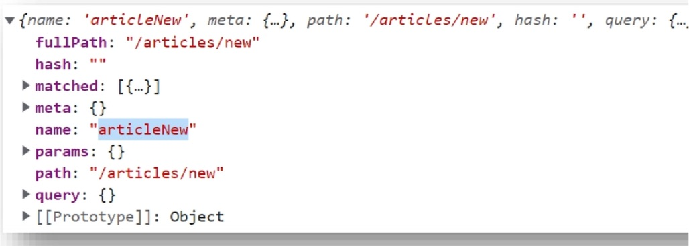
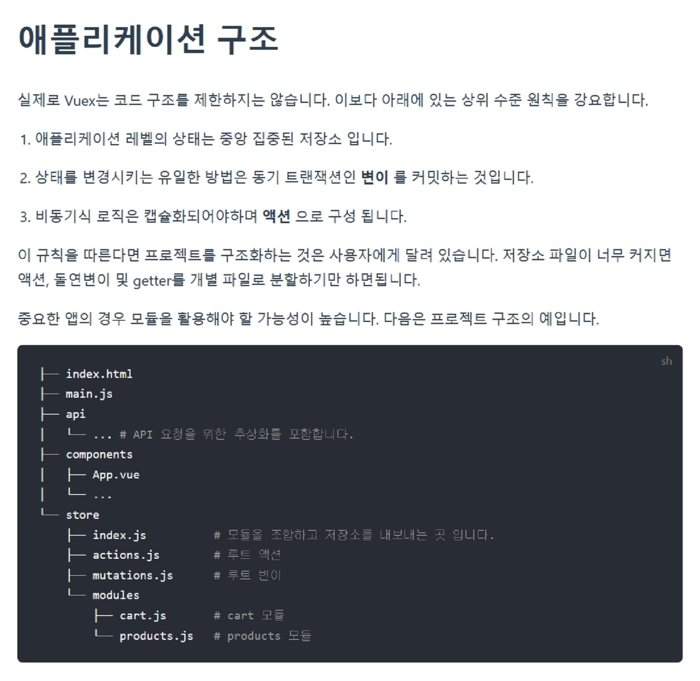

# Vue 05

## Vue Router

**사전 준비사항: 서버가 있다는 가정하에 서버와 통신하는 것이기 때문에 0516-django_back 폴더를 runserver 시켜주어야한다. **

0518-vue-front 폴더를 활용

 

0516-django_back 서버와 Client가 통신하는 구조를 만드는 것이기 때문이다.

**서버가 없으면 클라이언트는 동작하지 않는다.**


0518-vue-front 에서 code로 열기로 VS code로 열고 `npm run serve`하면 실행되지 않는다.

package.json, package-lock.json에 사용할 라이브러리는 다 있다.

``` bash
$ npm install
```

:heavy_check_mark: api폴더는 생성한 폴더이다. api폴더 안에 drf.js파일이 있다.


### POSTMAN

이 때 사용하는 url은 django에 urls.py에 작성되어있는 것이다.

`http://127.0.0.1:8000/api/v1/articles/`

**Body, raw, JSON**

```json
{
    "title": "HEllo",
    "content": "World"
}
```

**Headers**

KEY: Authorization

VALUE: Token Token_value


이렇게 작성하던 부분을 ArticleNewView.vue에서 버튼을 눌러서 url로 POST방식으로 보내게 할 것이다.

Headers와 Body의 내용을 포함해서보낸다.


### Skelecton

#### api/drf.js

미리 url을 만들어 주는 부분

```js
const HOST = 'http://localhost:8000/api/v1/'

const ACCOUNTS = 'accounts/'
const ARTICLES = 'articles/'
const COMMENTS = 'comments/'

export default {
  accounts: {
    login: () => HOST + ACCOUNTS + 'login/',
    logout: () => HOST + ACCOUNTS + 'logout/',
    signup: () => HOST + ACCOUNTS + 'signup/',
    // Token 으로 현재 user 판단
    currentUserInfo: () => HOST + ACCOUNTS + 'user/',
    // username으로 프로필 제공
    profile: username => HOST + ACCOUNTS + 'profile/' + username,
  },
  articles: {
    articles: () => HOST + ARTICLES,
    article: articlePk => HOST + ARTICLES + `${articlePk}/`,
    likeArticle: articlePk => HOST + ARTICLES + `${articlePk}/` + 'like/',
    comments: articlePk => HOST + ARTICLES + `${articlePk}/` + COMMENTS,
    comment: (articlePk, commentPk) =>
      HOST + ARTICLES + `${articlePk}/` + COMMENTS + `${commentPk}/`,
  },
}
```

사용 방법

```
drf.accounts.login()
// 'http://localhost:8000/api/v1/accounts/login/'
```


#### LoginView.vue

```vue
<template>
  <div>
    <h1>Login</h1>

    <form>
      <div>
        <label for="username">username: </label>
        <input type="text" id="username" required />
      </div>

      <div>
        <label for="password">password: </label>
        <input type="password" id="password" required />
      </div>

      <button>Login</button>
    </form>
  </div>
</template>

<script>
  // import { mapActions, mapGetters } from 'vuex'

  export default {
    name: 'LoginView',
    computed: {},
    methods: {},
  }
</script>
```


#### router/index.js

```js
import Vue from 'vue'
import VueRouter from 'vue-router'
import store from '../store'

import ArticleListView from '@/views/ArticleListView.vue'
import ArticleDetailView from '@/views/ArticleDetailView.vue'
import ArticleNewView from '@/views/ArticleNewView'
import ArticleEditView from '@/views/ArticleEditView'

import LoginView from '@/views/LoginView.vue'
import LogoutView from '@/views/LogoutView.vue'
import SignupView from '@/views/SignupView.vue'
import ProfileView from '@/views/ProfileView.vue'
import NotFound404 from '../views/NotFound404.vue'

Vue.use(VueRouter)

const routes = [
  /*
  accounts
    /login => LoginView
    /logout => LogoutView
    /signup => SignupView
    /profile/:username => ProfileView
  
  articles
    / => ArticleListView
    /articles/new => ArticleNewView
    /articles/:articlePk => ArticleDetailView
    /articles/:articlePk/edit => ArticleEditView
    /404 => NotFound404
    * => /404
  */
]

export default router
```

**Componets**

부품으로 사용되는 vue파일들

**Views**

url과 매핑되는 vue파일들

```js
import Vue from 'vue'
import VueRouter from 'vue-router'
import store from '../store'

import ArticleListView from '@/views/ArticleListView.vue'
import ArticleDetailView from '@/views/ArticleDetailView.vue'
import ArticleNewView from '@/views/ArticleNewView'
import ArticleEditView from '@/views/ArticleEditView'

import LoginView from '@/views/LoginView.vue'
import LogoutView from '@/views/LogoutView.vue'
import SignupView from '@/views/SignupView.vue'
import ProfileView from '@/views/ProfileView.vue'
import NotFound404 from '../views/NotFound404.vue'

const routes = [
  {
    path: '/login',
    name: 'login',
    component: LoginView
  },
  {
    path: '/logout',
    name: 'logout',
    component: LogoutView
  },
  {
    path: '/signup',
    name: 'signup',
    component: SignupView
  },
  {
    path: '/profile/:username',  // /profile/neo
    name: 'profile',
    component: ProfileView,
  },
  {
    path: '/',  // Home
    name: 'articles',
    component: ArticleListView
  },
  {
    path: '/articles/new',
    name: 'articleNew',
    component: ArticleNewView
  },
  {
    path: '/articles/:articlePk',
    name: 'article',
    component: ArticleDetailView
  },
  {
    path: '/articles/:articlePk/edit',
    name: 'articleEdit',
    component: ArticleEditView
  },
  {
    path: '/404',
    name: 'NotFound404',
    component: NotFound404
  },
  {
    path: '*',
    redirect: '/404'
  },
  
]
```


## 404 page

#### views/NotFound404.vue

```vue
<template>
  <div>
    <!--  -->
    <h1>404 Not Found</h1>
  </div>
</template>

<script>
  export default {
    name: 'NotFound404',
  }
</script>

<style>
  img.not-found {
    width: 100%;
  }
</style>
```


#### router/index.js

```js
const routes = [
  {
    path: '/404',
    name: 'NotFound404',
    component: NotFound404
  }, 
]
```


### 404 Not Found 시나리오

1 Vue Router에 등록되지 않는 routes일 경우

예) /no-such-routes

2 Vue Router에는 등록되어 있지만, 서버에서 해당 리소스를 찾을 수 없는 경우

예) /articles/987654321


### Vue Router에 등록되지 않는 routes

vue router는 routes 배열에서 순차적으로 URL을 검색한다.

등록되지 않은 모든(*) URL은 /404로 redirection한다.

브라우저에서 NotFound404 컴포넌트를 확인한다.

#### router/index.js

```js
const routes = [
  {
    path: '/404',
    name: 'NotFound404',
    component: NotFound404
  },
  {
    path: '*',
    redirect: '/404'
  },
]
```


### 서버에서 해당 리소스를 찾을 수 없는 경우

#### Vuex

```js
import router from '@/router'
axios({
    url: drf.articles.article(articlePk),
    method: 'get',
    headers: getters.authHeader,
    })
    .then(res => {})
    .catch(err => {
        console.error(err.response)
        if (err.response.status === 404) {
        router.push({ name: 'NotFound404' })
        }
    })
```


## Navigation Guards

### 전역 가드(Global Before Guards)

1 URL을 이동할 때마다, 이동하기 전 모든 경우에 발생

2 rounter 객체의 메서드로, 콜백 함수를 인자로 받고 해당 콜백 함수는 3개의 인자를 받는다.

1. to: 이동하려는 route의 정보를 담은 객체
2. from: 직전 route의 정보를 담은 객체
3. next: 실제 route의 이동을 조작하는 함수

3 반드시 마지막에 next()로 route 이동을 실행해야 한다.

```js
const routes = [ ... ]

const router = new VueRouter({
  mode: 'history',
  base: process.env.BASE_URL,
  routes,
})

router.beforeEach((to, from, next) => {
	...
})

export default router
```


예시

```js
/*
Navigation Guard 설정
  (이전 페이지에서 있던 에러 메시지 삭제)

  로그인(Authentication)이 필요 없는 route 이름들 저장(/login, /signup)

  0. router 에서 이동 감지

  1. 현재 이동하고자 하는 페이지가 로그인이 필요한지 확인
  
  2. 로그인이 필요한 페이지인데 로그인이 되어있지 않다면
    로그인 페이지(/login)로 이동

  3. 로그인이 되어 있다면
    원래 이동할 곳으로 이동
  
  4. 로그인이 되어있는데 /login, /signup 페이지로 이동한다면
    메인 페이지(/)로 이동
*/
```

#### @/router/index.js

```js
const routes = [
  // 인증 필요 없음
  {
    path: '/login',
    name: 'login',
    component: LoginView
  },
  {
    path: '/signup',
    name: 'signup',
    component: SignupView
  },
  // 인증 필요
  {
    path: '/articles/new',
    name: 'articleNew',
    component: ArticleNewView
  },
  {
    path: '/articles/:articlePk/edit',
    name: 'articleEdit',
    component: ArticleEditView
  },
]
```

```js
router.beforeEach((to, from, next) => {
  // 로그인 여부 확인 (Vuex 사용 시)
  const { isLoggedIn } = store.getters
  
  // Auth가 필요한 route의 name
  const noAuthPages = ['articleNew', 'articleEdit']
  
  // 현재 이동하고자 하는 페이지가 Auth가 필요한가?
  const isAuthRequired = authoPages.includes(to.name)

  // Auth가 필요한데, 로그인되어 있지 않다면?
  if (isAuthRequired && !isLoggedIn) {
    alert('Require Login. Redirecting..')
    // 로그인 페이지로 이동
    next({ name: 'login' })
  } else {
    // 원래 이동하려던 곳으로 이동
    next()
  }
})
```

**콜백 함수의 to 객체 구성**




## Vuex Module

### Module 분리



1 단일 파일(@/store/index.js)에 모든 state, getters, mutations, actions를 작성할 경우, App이 커질수록 파일의 크기가 너무 커진다.

2 기능에 따라 state, getters, mutations, actions를 모듈(파일)로 분리하여 사용한다.

.png)

.png)


### Module의 이름공간(module space)

.png)

.png)

1 다른 module에 작성되어 있어도, 실제로는 global namespace에 등록된다.

2 만약 확실하게 모듈별로 구분하고 싶다면, namespaced: true 옵션을 사용한다.


## Vuex - Component 구성

### accounts 사전준비

#### store/modules/accounts.js

##### mutation

```js
import router from '@/router'
import axios from 'axios'
import drf from '@/api/drf'

export default {
  // 생각해서 작성해야하는 부분
  state: {
    token: '',
    currentUser: {},
    profile: {},
    authError: null,
  },

  getters: {},

  mutations: {
    SET_TOKEN: (state, token) => state.token = token,
    SET_CURRENT_USER: (state, user) => state.currentUser = user,
    SET_PROFILE: (state, profile) => state.profile = profile,
    SET_AUTH_ERROR: (state, error) => state.authError = error
  },
}
```


##### getters

```js
import router from '@/router'
import axios from 'axios'
import drf from '@/api/drf'

export default {
  // state는 직접 접근하지 않겠다!
  // 생각해서 작성해야하는 부분
  state: {
    token: '',
    currentUser: {},
    profile: {},
    authError: null,
  },

  // 모든 state는 getters 를 통해서 접근하겠다.
  getters: {
    isLoggedIn: state => !!state.token,
    currentUser: state => state.currentUser,
    profile: state => state.profile,
    authError: state => state.authError,
    authHeader: state => ({ Authorization: `Token ${state.token}`})
  },

  mutations: {
    SET_TOKEN: (state, token) => state.token = token,
    SET_CURRENT_USER: (state, user) => state.currentUser = user,
    SET_PROFILE: (state, profile) => state.profile = profile,
    SET_AUTH_ERROR: (state, error) => state.authError = error
  },
}
```

:heavy_check_mark: LoginView.vue components에서 꺼낼 때 mapActions, mapGetters만 사용할 것이다.

:x: mapState, mapMutations는 사용하지 않을 것이다.


Vue에서 로그인 여부는 유효한 token을 가지고 있는 지 여부이다.

`isLoggedIn: state => state.token` 이렇게 하면 값이 나오게 된다.

우리는 이 결과를 True, False를 받고 싶다. 따라서 `isLoggedIn: state => !!state.token`로 작성한다.


##### actions

어떤 값을 영구저장할 때 브라우저에 저장하는 방법으로 localStorage가 있었다.

**saveToken**

state.token 추가

localStorage에 token 추가

* Login
* Signup

**removeToken**

state.token ''로 변경

localStorage.setItem('token')을 ''로 변경

:heavy_check_mark: 반복되는 작업이기 때문에 함수로 만들었다.

```js
import router from '@/router'
import axios from 'axios'
import drf from '@/api/drf'

export default {
  state: {
  },

  getters: {
  },

  mutations: {
  },

  actions: {
    saveToken({ commit }, token) {
      /* 
      state.token 추가 
      localStorage에 token 추가
      */
      commit('SET_TOKEN', token)
      localStorage.setItem('token', token)
    },

    removeToken({ commit }) {
      /* 
      state.token 삭제
      localStorage에 token 추가
      */
      commit('SET_TOKEN', '')
      localStorage.setItem('token', '')
    },
  },
}

```


### 각 기능을 위한 코드실습

### 📁accounts Signup

#### SignupView.vue

다음과 같이 요청을 보내면 key값이 출력이 된다.

POST `http://127.0.0.1:8000/api/v1/accounts/signup/`

Body - raw

```json
{
    "username": "user", "password1": "1234", "password2" : "1234"
}
```


```vue
<template>
  <div>
    <h1>Signup</h1>

    <form>
      <div>
        <label for="username">Username: </label>
        <input type="text" id="username" required />
      </div>
      <div>
        <label for="password1">Password: </label>
        <input type="password" id="password1" required />
      </div>
      <div>
        <label for="password2">Password Confirmation:</label>
        <input type="password" id="password2" required />
      </div>
      <div>
        <button>Signup</button>
      </div>
    </form>
  </div>
</template>

<script>
  export default {
    components: {},
    name: 'SignupView',
    data() {
      return {}
    },
    computed: {},
    methods: {},
  }
</script>
```


#### store/modules/accounts.js

##### actions

`credentials`가 사용자 입력 정보

axios에 필요한 것 

* url
* method
* data

```js
import router from '@/router'
import axios from 'axios'
import drf from '@/api/drf'

export default {
  actions: {
    saveToken({ commit }, token) {
      /* 
      state.token 추가 
      localStorage에 token 추가
      */
      commit('SET_TOKEN', token)
      localStorage.setItem('token', token)
    },
      
    login({ commit, dispatch }, credentials) {
      /* 
      POST: 사용자 입력정보를 login URL로 보내기
        성공하면
          응답 토큰 저장
          현재 사용자 정보 받기
          메인 페이지(ArticleListView)로 이동
        실패하면
          에러 메시지 표시
      */
      axios({
        url: drf.accounts.login(),
        method: 'post',
        data: credentials
      })
        .then(res => {
          const token = res.data.key
          dispatch('saveToken', token)
          router.push({ name: 'articles' })	// 메인 페이지(ArticleListView)로 이동
        })
        .catch(err => {
          console.error(err)
        })
    },
  },
}
```


#### SignupView.vue

data의 return 값 추가

`  data() { return { credentials: { username: '', password1: '', password2: '', } } }`

input tag 에 v-model 추가

`<input v-model="credentials.username" type="text" id="username" required/>`

`<input v-model="credentials.password1" type="password" id="password1" required />`

`<input v-model="credentials.password2" type="password" id="password2" required />`

mapAction을 import 하고 methods 작성

`import { mapActions } from 'vuex'`

`methods: { ...mapActions(['signup'])}`

form 에 v-on 추가

`<form @submit.prevent="signup(credentials)">`

```vue
<template>
  <div>
    <h1>Signup</h1>

    <account-error-list v-if="authError"></account-error-list>

    <form @submit.prevent="signup(credentials)">
      <div>
        <label for="username">Username: </label>
        <input  v-model="credentials.username" type="text" id="username" required/>
      </div>
      <div>
        <label for="password1">Password: </label>
        <input v-model="credentials.password1" type="password" id="password1" required />
      </div>
      <div>
        <label for="password2">Password Confirmation:</label>
        <input v-model="credentials.password2" type="password" id="password2" required />
      </div>
      <div>
        <button>Signup</button>
      </div>
    </form>
  </div>
</template>

<script>
  import { mapActions } from 'vuex'
  import AccountErrorList from '@/components/AccountErrorList.vue'

  export default {
    name: 'SignupView',
    components: {},
    data() {
      return {
        credentials: {
          username: '',
          password1: '',
          password2: '',
        }
      }
    },
    methods: {
      ...mapActions(['signup'])
    },
  }
</script>
```


**Sign up 실패 시 error message**

#### store/modules/accounts.js

##### state, mutations, actions

`authError`가 error message저장을 위해 만든 state

mutations `SET_AUTH_ERROR`

catch `console.error(err.response.data)`, `commit('SET_AUTH_ERROR', err.response.data)`

```js
import router from '@/router'
import axios from 'axios'
import drf from '@/api/drf'

export default {
  state: {
    token: localStorage.getItem('token') || '' ,
    currentUser: {},
    profile: {},
    authError: null,
  },    
  getters: {
    isLoggedIn: state => !!state.token,
    currentUser: state => state.currentUser,
    profile: state => state.profile,
    authError: state => state.authError,
    authHeader: state => ({ Authorization: `Token ${state.token}`})
  },
  mutations: {
    SET_TOKEN: (state, token) => state.token = token,
    SET_CURRENT_USER: (state, user) => state.currentUser = user,
    SET_PROFILE: (state, profile) => state.profile = profile,
    SET_AUTH_ERROR: (state, error) => state.authError = error
  },
  actions: {
    saveToken({ commit }, token) {
      /* 
      state.token 추가 
      localStorage에 token 추가
      */
      commit('SET_TOKEN', token)
      localStorage.setItem('token', token)
    },
      
    login({ commit, dispatch }, credentials) {
      /* 
      POST: 사용자 입력정보를 login URL로 보내기
        성공하면
          응답 토큰 저장
          현재 사용자 정보 받기
          메인 페이지(ArticleListView)로 이동
        실패하면
          에러 메시지 표시
      */
      axios({
        url: drf.accounts.login(),
        method: 'post',
        data: credentials
      })
        .then(res => {
          const token = res.data.key
          dispatch('saveToken', token)
          router.push({ name: 'articles' })	// 메인 페이지(ArticleListView)로 이동
        })
        .catch(err => {
          console.error(err.response.data)
          commit('SET_AUTH_ERROR', err.response.data)
        })
    },
  },
}
```


#### AccountsErrorList.vue

accounts.js의 authError를 보여주는 역할

```vue
<template>
  <div class="account-error-list"></div>
</template>

<script>
  export default {
    name: 'AccountErrorList',
    computed: {},
  }
</script>

<style>
  .account-error-list {
    color: red;
  }
</style>
```

```vue
<template>
  <div class="account-error-list">
    <p v-for="(errors, field) in authError" :key="field">
      {{ field }}
      <ul>
        <li v-for="(error, idx) in errors" :key="idx">
          {{ error }}
        </li>
      </ul>
    </p>
  </div>
</template>

<script>
  import { mapGetters } from 'vuex'
  
  export default {
    name: 'AccountErrorList',
    computed: {
      ...mapGetters(['authError'])
    },
  }
</script>
```


#### SignupView.vue

AccountsErrorList.vue를 SignupView.vue에 보여줄 것이다. (authError가 있을 때만)

`import AccountErrorList from '@/components/AccountErrorList.vue'`

`components: { AccountErrorList, }`

`computed: { ...mapGetters(['authError'])}`

`<template><div><account-error-list v-if="authError"></account-error-list></div></template>`

```vue
<template>
  <div>
    <h1>Signup</h1>
    <account-error-list v-if="authError"></account-error-list>
  </div>
</template>

<script>
  import { mapActions, mapGetters } from 'vuex'
  import AccountErrorList from '@/components/AccountErrorList.vue'

  export default {
    name: 'SignupView',
    components: {
      AccountErrorList,
    },
    data() {
      return {
        credentials: {
          username: '',
          password1: '',
          password2: '',
        }
      }
    },
    computed: {
      ...mapGetters(['authError'])
    },
    methods: {
      ...mapActions(['signup'])
    },
  }
</script>
```


**현재 사용자 정보 받기**

127.0.0.1:8000/api/v1/accounts/을 통해서 볼수 있는 URL의

127.0.0.1:8000/api/v1/accounts/profile

127.0.0.1:8000/api/v1/accounts/user

둘의 차이점은 profile은 A가 B,C,D에 대해서 보는 것이고 user는 A가 Token을 기반으로 본인에 대해 보는 것이다.

**POSTMAN**

127.0.0.1:8000/api/v1/accounts/user

<u>headers(KEY: VALUE)</u>

Authrization : Token 토큰 키

<u>응답</u>

pk, username, email, first_name, last_name

#### store/modules/accounts.js

**fetchUser**

actions의 fetchCurrentUser가 Token값을 기반으로 내 정보를 받아올 것이다.

받은 정보로 state의 currentUser를 채워줄 것이다. 이때 mutations의 SET_CURRENT_USER를 사용한다. 

```js
export default {
  // namespaced: true,

  // state는 직접 접근하지 않겠다!
  state: {
    token: localStorage.getItem('token') || '' ,
    currentUser: {},
    profile: {},
    authError: null,
  },
  getters: {
      // 함수가 아니라 객체라면 () 로 한번더 묶어준다.
      // { Authorization: `Token ${state.token}`} 를 ()롤 묶어준다.
    authHeader: state => ({ Authorization: `Token ${state.token}`})
  },  
  actions: {
    fetchCurrentUser({ commit, getters, dispatch }) {
      /*
      GET: 사용자가 로그인 했다면(토큰이 있다면)
        currentUserInfo URL로 요청보내기
          성공하면
            state.cuurentUser에 저장
          실패하면(토큰이 잘못되었다면: Token 만료, Token이 유효하지 않다.)
            기존 토큰 삭제
            LoginView로 이동(다시 로그인할 수 있도록)
      */
      if (getters.isLoggedIn) {
        axios({
          url: drf.accounts.currentUserInfo(),
          method: 'get',
          headers: getters.authHeader,
        })
          .then(res => commit('SET_CURRENT_USER', res.data))
          .catch(err => {
            if (err.response.status === 401) {
              dispatch('removeToken')
              router.push({ name: 'login' })
            }
          })
      }
    },
  }
```

**fetchCurrentUser를 signup에 추가**

```js
    signup({ commit, dispatch }, credentials) {
      /* 
      POST: 사용자 입력정보를 signup URL로 보내기
        성공하면
          응답 토큰 저장
          현재 사용자 정보 받기
          메인 페이지(ArticleListView)로 이동
        실패하면
          에러 메시지 표시
      */
      axios({
        url: drf.accounts.signup(),
        method: 'post',
        data: credentials
      })
        .then(res => {
          const token = res.data.key
          dispatch('saveToken', token)
          // saveToken이후에 fetchCurrentUser를 dispatch한다.
          dispatch('fetchCurrentUser')
          router.push({ name: 'articles' })
        })
        .catch(err => {
          console.error(err.response.data)
          commit('SET_AUTH_ERROR', err.response.data)
        })
    },
```

:heavy_check_mark: Devtool의 Vue에서 state의 currentUser가 들어온 것을 확인할 수 있다.


### 📁accounts Login

#### store/modules/accounts.js

Signup의 코드를 활용한다. 붙여넣기 이후 다음내용만 수정한다.

`url: drf.accounts.login()`

```js
import router from '@/router'
import axios from 'axios'
import drf from '@/api/drf'

export default {
  // namespaced: true,

  state: {
    token: '',
    currentUser: {},
    profile: {},
    authError: null,
  },

  getters: {},

  mutations: {},

  actions: {
    saveToken({ commit }, token) {
      /* 
      state.token 추가 
      localStorage에 token 추가
      */
    },
    login({ commit, dispatch }, credentials) {
      /* 
      POST: 사용자 입력정보를 login URL로 보내기
        성공하면
          응답 토큰 저장
          현재 사용자 정보 받기
          메인 페이지(ArticleListView)로 이동
        실패하면
          에러 메시지 표시
      */
      axios({
        url: drf.accounts.login(),
        method: 'post',
        data: credentials
      })
        .then(res => {
          const token = res.data.key
          dispatch('saveToken', token)
          dispatch('fetchCurrentUser')
          router.push({ name: 'articles' })
        })
        .catch(err => {
          console.error(err.response.data)
          commit('SET_AUTH_ERROR', err.response.data)
        }) 
    },
    fetchCurrentUser({ commit, getters, dispatch }) {
      /*
      GET: 사용자가 로그인 했다면(토큰이 있다면)
        currentUserInfo URL로 요청보내기
          성공하면
            state.cuurentUser에 저장
          실패하면(토큰이 잘못되었다면)
            기존 토큰 삭제
            LoginView로 이동
      */
    },
  },
}
```


#### LoginView.vue

`data() { return { credentials: { username: '', password: '', } } }`

위 data에 맞추어 input에 v-model연결

`<input v-model="credentials.username" type="text" id="username" required />`

`<input v-model="credentials.password" type="password" id="password" required />`

호출할 수 있게 form tag에 v-on추가

`<form @submit.prevent="login(credentials)">`

account-error-list 추가

`import AccountErrorList from '@/components/AccountErrorList.vue'`

`<account-error-list v-if="authError"></account-error-list>`

computed와 methods 추가

`import { mapActions, mapGetters } from 'vuex'`

`computed: { ...mapGetters(['authError']) },`
`methods: { ...mapActions(['login']) },`

```vue
<template>
  <div>
    <h1>Login</h1>

    <account-error-list v-if="authError"></account-error-list>


    <form @submit.prevent="login(credentials)">
      <div>
        <label for="username">username: </label>
        <input v-model="credentials.username" type="text" id="username" required />
      </div>

      <div>
        <label for="password">password: </label>
        <input v-model="credentials.password" type="password" id="password" required />
      </div>

      <button>Login</button>
    </form>
  </div>
</template>

<script>
  import { mapActions, mapGetters } from 'vuex'
  import AccountErrorList from '@/components/AccountErrorList.vue'

  export default {
    name: 'LoginView',
    components: {
      AccountErrorList,
    },
    data() {
      return {
        credentials: {
          username: '',
          password: '',
        }
      }
    },
  	computed: {
      ...mapGetters(['authError'])
    },
    methods: {
      ...mapActions(['login'])
    },
  }
</script>
```

:heavy_check_mark: Devtool의 Vue에서 state의 currentUser가 들어온 것을 확인할 수 있다.


### 📁accounts Logout

#### store/modules/accounts.js

아래 코드를 logout({ getters, dispatch })안에 작성해준다.

:heavy_check_mark: error가 생기면 할 것은 생각해볼 것 `console.error(err.response)`만 추가된 코드이다.

:heavy_check_mark: 넘어오는 인자 res를 받지 않을 것으로 () 작성한다.

```js
import router from '@/router'
import axios from 'axios'
import drf from '@/api/drf'

export default {
  // namespaced: true,

  state: {
    token: '',
    currentUser: {},
    profile: {},
    authError: null,
  },

  getters: {},

  mutations: {},

  actions: {
    removeToken({ commit }) {
      /* 
      state.token 삭제
      localStorage에 token 추가
      */
      commit('SET_TOKEN', '')
      localStorage.setItem('token', '')
    },
      
    logout({ getters, dispatch }) {
      /* 
      POST: token을 logout URL로 보내기
        성공하면
          토큰 삭제
          사용자 알람
          LoginView로 이동
        실패하면
          에러 메시지 표시
      */
      axios({
        url: drf.accounts.logout(),
        method: 'post',
        // data: {},
        headers: getters.authHeader,
      })
        .then(() => {						// 넘어오는 인자 res를 받지 않을 것으로 () 작성
          dispatch('removeToken')			// Token 삭제
          alert('성공적으로 logout!')		// 사용자 알람
          router.push({ name: 'login' })	// LoginView로 이동
        })
        .error(err => {						// 실패하면
          console.error(err.response)		// error message 표시
        })
    },
  },
}
```


#### LogoutView.vue

:heavy_check_mark: created를 활용

```vue
<template>
  <div>
    <h1>Logout</h1>
  </div>
</template>

<script>
  import { mapActions, mapGetters } from 'vuex'

  export default {
    methods: {
      ...mapActions(['logout'])
    },
    computed: {
      ...mapGetters(['isLoggedIn'])
    },
    created() {
      if (this.isLoggedIn) {
        this.logout()
      } else {
        alert('잘못된 접근')
        this.$router.back()
      }
    },
  }
</script>
```

 

#### store/modules/accounts.js

:heavy_check_mark: state의 token을 바꿔준다.

```js
export default {
  state: {
    token: localStorage.getItem('token') || '' ,
    currentUser: {},
    profile: {},
    authError: null,
  },
}    
```


### 📁accounts Profile

#### ProfileView.vue

```vue
<template>
  <div>
    <h1>{{ profile.username }}</h1>

    <h2>작성한 글</h2>
    <ul>
      <li v-for="article in profile.articles" :key="article.pk">
        <router-link :to="{ name: 'article', params: { articlePk: article.pk } }">
          {{ article.title }}
        </router-link>
      </li>
    </ul>

    <h2>좋아요 한 글</h2>
    <ul>
      <li v-for="article in profile.like_articles" :key="article.pk">
        <router-link :to="{ name: 'article', params: { articlePk: article.pk } }">
          {{ article.title }}
        </router-link>
      </li>
    </ul>
  </div>
</template>

<script>
import { mapGetters, mapActions } from 'vuex'


export default {
  name: 'ProfileView',
  computed: {
    ...mapGetters(['profile'])
  },
  methods: {
    ...mapActions(['fetchProfile'])
  },
  created() {
    // path: '/profile/:username'
    const payload = { username: this.$route.params.username }
    this.fetchProfile(payload)
  },
}
</script>
```


#### store/modules/accounts.js

```js
import router from '@/router'
import axios from 'axios'
import drf from '@/api/drf'

export default {
  state: {
    token: localStorage.getItem('token') || '' ,
    currentUser: {},
    profile: {},
    authError: null,
  },
  // 모든 state는 getters 를 통해서 접근하겠다.
  getters: {
    profile: state => state.profile,
    authHeader: state => ({ Authorization: `Token ${state.token}`})
  },
  mutations: {
    SET_PROFILE: (state, profile) => state.profile = profile,
  },
  actions: {
    fetchProfile({ commit, getters }, { username }) {
      /*
      GET: profile URL로 요청보내기
        성공하면
          state.profile에 저장
      */
      axios({
        url: drf.accounts.profile(username),
        method: 'get',
        headers: getters.authHeader,
      })
        .then(res => {
          commit('SET_PROFILE', res.data)
        })
    },
  },
}
```


#### router/index.js

```js
import Vue from 'vue'
import VueRouter from 'vue-router'
import store from '../store'
import ProfileView from '@/views/ProfileView.vue'

Vue.use(VueRouter)

const routes = [
  {
    path: '/profile/:username',  // /profile/neo
    name: 'profile',
    component: ProfileView,
  }, 
]

router.beforeEach((to, from, next) => {
  // 이전 페이지에서 발생한 에러메시지 삭제
  store.commit('SET_AUTH_ERROR', null)

  const { isLoggedIn } = store.getters

  const noAuthPages = ['login', 'signup']

  const isAuthRequired = !noAuthPages.includes(to.name)

  if (isAuthRequired && !isLoggedIn) {
    alert('Require Login. Redirecting..')
    next({ name: 'login' })
  } else {
    next()
  }

  if (!isAuthRequired && isLoggedIn) {
    next({ name: 'articles' })
  }
})

export default router
```


#### src/api/drf.js

```js
const HOST = 'http://localhost:8000/api/v1/'
const ACCOUNTS = 'accounts/'

export default {
  accounts: {
    // username으로 프로필 제공
    profile: username => HOST + ACCOUNTS + 'profile/' + username,
  },
}
```


### 📁 articles Read

#### src/store/index.js

Modules에 추가

```js
import Vue from 'vue'
import Vuex from 'vuex'

import articles from './modules/articles'
import accounts from './modules/accounts'

Vue.use(Vuex)

export default new Vuex.Store({
  modules: { accounts, articles },
})
```

:heavy_check_mark: 상황에 따라 각 module에 `namespaced: true`를 해야할 수도 있다.


#### store/modules/articles.js

사용할 article의 개수에 맞게 기본적인 구조를 잡아둔다.

`state: { articles: [], article: {}, }`

`actions: { fetchArticles({ commit, getters }){ }, fetchArticle({ commit, getters }){ }}`

`mutations: { SET_ARTICLES: (state, articles) => state.articles = articles, SET_ARTICLE: (state, article) => state.article = article }`

`getters: { articles: state => state.articles, article: state => state.article, }`

```js
import axios from 'axios'
import router from '@/router'
import drf from '@/api/drf'

import _ from 'lodash'

export default {
  state: {
    articles: [],
    article: {},
  },

  getters: {
    articles: state => state.articles,
    article: state => state.article,
  },

  mutations: {
    SET_ARTICLES: (state, articles) => state.articles = articles,
    SET_ARTICLE: (state, article) => state.article = article,
  },

  actions: {
    fetchArticles({ commit, getters }) {
    },

    fetchArticle({ commit, getters }) {
    },
  },
}
```


내가 쓴 article인지 여부에 따라 달라지는 것이 있다.

#### store/modules/articles.js

```js
export default {
  getters: {
    currentUser: state => state.currentUser,
  },
}
```

#### store/modules/articles.js

`isAuthor: (state, getters) => { return state.article.user?.username === getters.currentUser.username }`

단일 게시글을 선택했는지 여부

`isArticle: state => !_.isEmpty(state.article)`

```js
import axios from 'axios'
import router from '@/router'
import drf from '@/api/drf'

import _ from 'lodash'

export default {
  state: {
    articles: [],
    article: {},
  },

  getters: {
    articles: state => state.articles,
    article: state => state.article,
	isAuthor: (state, getters) => {
      return state.article.user?.username === getters.currentUser.username
    },
    isArticle: state => !_.isEmpty(state.article),
  },

  mutations: {
    SET_ARTICLES: (state, articles) => state.articles = articles,
    SET_ARTICLE: (state, article) => state.article = article,
  },

  actions: {
    fetchArticles({ commit, getters }) {
    },

    fetchArticle({ commit, getters }) {
    },
  },
}
```

#### 🎯 fetchArticles

##### store/modules/articles.js

```js
import axios from 'axios'
import drf from '@/api/drf'

export default {
  actions: {
    fetchArticles({ commit, getters }) {
      /* 게시글 목록 받아오기
      GET: articles URL (token)
        성공하면
          응답으로 받은 게시글들을 state.articles에 저장
        실패하면
          에러 메시지 표시
      */
      axios({
        url: drf.articles.articles(),
        method: 'get',
        headers: getters.authHeader,
      })
        .then(res => commit('SET_ARTICLES', res.data))
        .catch(err => console.error(err.response))
    },
  },
}
```

##### src/api/drf.js

```js
const HOST = 'http://localhost:8000/api/v1/'

const ACCOUNTS = 'accounts/'
const ARTICLES = 'articles/'
const COMMENTS = 'comments/'

export default {
  articles: {
    // /articles/
    articles: () => HOST + ARTICLES,
    // /articles/1/ pk값 써주는 것
    article: articlePk => HOST + ARTICLES + `${articlePk}/`,
  },
}
```

##### ArticleListView.vue

```vue
<template>
  <div>
    <h1>Home</h1>
    <ul>
      <li v-for="article in articles" :key="article.pk">
        <!-- 작성자 -->
        {{ article.user.username }} : 

        <!-- 글 이동 링크 (제목) -->
        <router-link 
          :to="{ name: 'article', params: {articlePk: article.pk} }">
          {{ article.title }}
        </router-link>

        <!-- 댓글 개수/좋아요 개수 -->
        =>
        ({{ article.comment_count }}) | +{{ article.like_count }}

      </li>
    </ul>
   
  </div>
</template>

<script>
  import { mapActions, mapGetters } from 'vuex'

  export default {
    name: 'ArticleList',
    computed: {
      ...mapGetters(['articles'])
    },
    methods: {
      ...mapActions(['fetchArticles'])
    },
    created() {
      this.fetchArticles()
    },
  }
</script>
```

:heavy_check_mark: {{ article.user.username }} : 클릭 시 profile 페이지로 가게 할 수도 있다.


#### 🎯 fetchArticle

##### store/modules/articles.js

```js
import axios from 'axios'
import drf from '@/api/drf'

export default {
  state: {
    article: {},
  },    
  mutations: {
    SET_ARTICLE: (state, article) => state.article = article,
  },
  actions: {
    fetchArticle({ commit, getters }) {
      /* 단일 게시글 받아오기
      GET: article URL (token)
        성공하면
          응답으로 받은 게시글들을 state.articles에 저장
        실패하면
          단순 에러일 때는
            에러 메시지 표시
          404 에러일 때는
            NotFound404 로 이동
      */
      axios({
        url: drf.articles.article(3),	// 임의의 값 3
        method: 'get',
        headers: getters.authHeader,
      })
        .then(res => commit('SET_ARTICLE', res.data))
        .catch(err => console.error(err.response))
    },
  },
}
```

##### src/api/drf.js

:heavy_check_mark: profile과 비슷한 상황

```js
const HOST = 'http://localhost:8000/api/v1/'

const ACCOUNTS = 'accounts/'
const ARTICLES = 'articles/'
const COMMENTS = 'comments/'

export default {
  articles: {
    // /articles/
    articles: () => HOST + ARTICLES,
    // /articles/1/ pk값 써주는 것
    article: articlePk => HOST + ARTICLES + `${articlePk}/`,
  },
}
```

##### ArticleDetailView.vue

`data() { return { articlePk: this.$route.params.articlePk, } }` :heavy_check_mark:Dev tool의 Vue에서 확인가능

`created() {this.fetchArticle(this.articlePk) }`


```vue
<template>
  <div>
    <h1>{{ article.title }}</h1>
    <p>
      {{ article.content }}
    </p>
  </div>
</template>

<script>
  import { mapGetters, mapActions } from 'vuex'
  import CommentList from '@/components/CommentList.vue'

  export default {
    name: 'ArticleDetail',
    components: { CommentList },
    data() {
      return {
        articlePk: this.$route.params.articlePk,
      }
    },
    computed: {
      ...mapGetters(['isAuthor', 'article']),
      likeCount() {
        return this.article.like_users?.length
      }
    },
    methods: {
      ...mapActions([ 'fetchArticle'])
    },
    created() {
      this.fetchArticle(this.articlePk)
    },
  }
</script>
```


##### store/modules/articles.js

`fetchArticle({ commit, getters }, articlePk)`

```js
import axios from 'axios'
import drf from '@/api/drf'

export default {
  state: {
    article: {},
  },    
  mutations: {
    SET_ARTICLE: (state, article) => state.article = article,
  },
  actions: {
    fetchArticle({ commit, getters }, articlePk) {
      axios({
        url: drf.articles.article(articlePk),
        method: 'get',
        headers: getters.authHeader,
      })
        .then(res => commit('SET_ARTICLE', res.data))
        .catch(err => console.error(err.response))
    },
  },
}
```

:x: detail페이지의 그 값이 없을 때 404 error

`if (err.response.status === 404) { router.push({ name: 'NotFound404' }) }`

```js
import axios from 'axios'
import drf from '@/api/drf'

export default {
  state: {
    article: {},
  },    
  mutations: {
    SET_ARTICLE: (state, article) => state.article = article,
  },
  actions: {
    fetchArticle({ commit, getters }, articlePk) {
      axios({
        url: drf.articles.article(articlePk),
        method: 'get',
        headers: getters.authHeader,
      })
        .then(res => commit('SET_ARTICLE', res.data))
        .catch(err => {
          console.error(err.response)
          if (err.response.status === 404) {
            router.push({ name: 'NotFound404' })
          }
        })
    },
  },
}
```


### 📁articles Edit / Delete

#### ArticleDetailView.vue

```vue
<template>
  <div>
    <!-- Article Edit/Delete UI -->
    <div v-if="isAuthor">
      <router-link :to="{ name: 'articleEdit', params: { articlePk } }">
        <button>Edit</button>
      </router-link>
      |
      <button @click="deleteArticle(articlePk)">Delete</button>
    </div>

    <!-- Article Like UI -->
    <div>
      Likeit:
      <button
        @click="likeArticle(articlePk)"
      >{{ likeCount }}</button>
    </div>

    <hr />
    <!-- Comment UI -->
    <comment-list :comments="article.comments"></comment-list>

  </div>
</template>
```

:x: CurrentUser 반영되어있지 않은 코드이다.

:heavy_check_mark: 해결하기 위해서 App.vue를 수정한다.

#### App.vue

```vue
<template>
  <div id="app">
    <nav-bar></nav-bar>
    <hr />
    <router-view></router-view>
  </div>
</template>

<script>
  import NavBar from '@/components/NavBar.vue'

  import { mapActions } from 'vuex'

  export default {
    name: 'App',
    methods: {
      ...mapActions(['fetchCurrentUser'])
    },
    created() {
      this.fetchCurrentUser()
    }
  }
</script>
```


#### src/store/modules/articles.js

```js
import axios from 'axios'
import drf from '@/api/drf'
import router from '@/router'

import _ from 'lodash'
// import accounts from './accounts'

export default {
  // namespaced: true,
  state: {
    articles: [],
    article: {},
  },
  mutations: {
    SET_ARTICLES: (state, articles) => state.articles = articles,
    SET_ARTICLE: (state, article) => state.article = article,
    SET_ARTICLE_COMMENTS: (state, comments) => (state.article.comments = comments),
  },
  actions: {
    updateArticle({ commit, getters }, { pk, title, content}) {
      /* 게시글 수정
      PUT: article URL (게시글 입력정보, token)
        성공하면
          응답으로 받은 게시글을 state.article에 저장
          ArticleDetailView 로 이동
        실패하면
          에러 메시지 표시
      */
      axios({
        url: drf.articles.article(pk),
        method: 'put',
        data: { title, content },
        headers: getters.authHeader,
      })
        .then(res => {
          commit('SET_ARTICLE', res.data)
          router.push({
            name: 'article',
            params: { articlePk: getters.article.pk }
          })
        })
    },

    deleteArticle({ commit, getters }, articlePk) {
      /* 게시글 삭제
      사용자가 확인을 받고
        DELETE: article URL (token)
          성공하면
            state.article 비우기
            AritcleListView로 이동
          실패하면
            에러 메시지 표시
      */
      
      if (confirm('정말 삭제하시겠습니까?')) {
        axios({
          url: drf.articles.article(articlePk),
          method: 'delete',
          headers: getters.authHeader,
        })
          .then(() => {
            commit('SET_ARTICLE', {})
            router.push({ name: 'articles' })
          })
          .catch(err => console.error(err.response))
      }
    },
  },
}

```


### 📁articles Like

#### src/store/modules/articles.js

```js
import axios from 'axios'
import drf from '@/api/drf'
import router from '@/router'

import _ from 'lodash'
// import accounts from './accounts'

export default {
  // namespaced: true,
  state: {
    articles: [],
    article: {},
  },
  mutations: {
    SET_ARTICLE: (state, article) => state.article = article,
  },
  actions: {
    likeArticle({ commit, getters }, articlePk) {
      /* 좋아요
      POST: likeArticle URL(token)
        성공하면
          state.article 갱신
        실패하면
          에러 메시지 표시
      */
      axios({
        url: drf.articles.likeArticle(articlePk),
        method: 'post',
        headers: getters.authHeader,
      })
        // 할 때마다 객체가 온다.
        .then(res => commit('SET_ARTICLE', res.data))
        .catch(err => console.error(err.response))
    },
  },
}
```


#### ArticleDetailView.vue

```vue
<template>
  <div>
    <h1>{{ article.title }}</h1>

    <p>
      {{ article.content }}
    </p>
    <!-- Article Like UI -->
    <div>
      Likeit:
      <button
        @click="likeArticle(articlePk)"
      >{{ likeCount }}</button>
    </div>
  </div>
</template>

<script>
  import { mapGetters, mapActions } from 'vuex'
  import CommentList from '@/components/CommentList.vue'

  export default {
    name: 'ArticleDetail',
    components: { CommentList },
    data() {
      return {
        articlePk: this.$route.params.articlePk,
      }
    },
    methods: {
      ...mapActions([
        'likeArticle',
      ])
    },
  }
</script>
```

:heavy_check_mark: 좋아요를 누른것인지 아닌지를 확인하는 방법

* CurrentUser의 username와 article의 like_users안의 object에 같은 username이 있는지 확인하면 된다.


### 📁NavBar

#### NavBar.vue

:heavy_check_mark: isLoggedIn을 기준으로 진행된다.

```vue
<template>
  <nav>
    <ul>
      <li>
        <router-link :to="{ name: 'articles' }">Home</router-link>
      </li>

      <li v-if="!isLoggedIn">
        <router-link :to="{ name: 'login' }">Login</router-link>
      </li>
      <li v-if="!isLoggedIn">
        <router-link :to="{ name: 'signup' }">Signup</router-link>
      </li>

      <li v-if="isLoggedIn">
        <router-link :to="{ name: 'articleNew' }">New</router-link>
      </li>
      <li v-if="isLoggedIn">
        <router-link :to="{ name: 'profile', params: { username } }">
          {{ currentUser.username }}'s page
        </router-link>
      </li>
      <li v-if="isLoggedIn">
        <router-link :to="{ name: 'logout' }">Logout</router-link>
      </li>
    </ul>
  </nav>
</template>

<script>
  import { mapGetters } from 'vuex'

  export default {
    name: 'NavBar',
    computed: {
      ...mapGetters(['isLoggedIn', 'currentUser']),
      username() {
        return this.currentUser.username ? this.currentUser.username : 'guest'
      },
    },
  }
</script>
```


#### App.vue

```vue
<template>
  <div id="app">
    <nav-bar></nav-bar>
    <hr />
    <router-view></router-view>
  </div>
</template>

<script>
  import NavBar from '@/components/NavBar.vue'
</script>
```


### 📁Navigation Gaurd

#### router/index.js

```js
router.beforeEach((to, from, next) => {
  // 이전 페이지에서 발생한 에러메시지 삭제
  store.commit('SET_AUTH_ERROR', null)

  const { isLoggedIn } = store.getters

  const noAuthPages = ['login', 'signup']

  const isAuthRequired = !noAuthPages.includes(to.name)

  if (isAuthRequired && !isLoggedIn) {
    alert('Require Login. Redirecting..')
    next({ name: 'login' })
  } else {
    next()
  }

  if (!isAuthRequired && isLoggedIn) {
    next({ name: 'articles' })
  }
})
```


### 📁Create article

```vue

```

